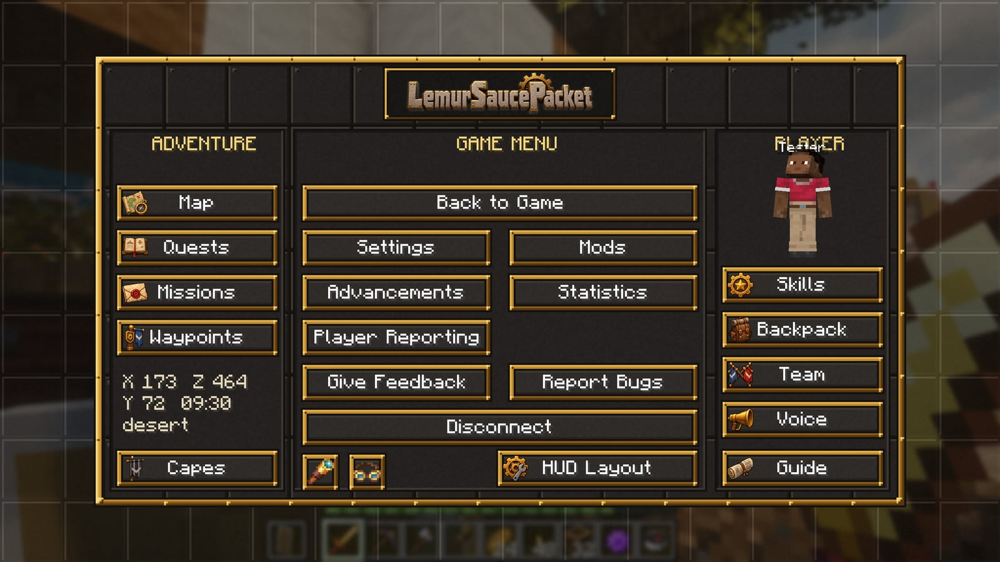

# LemurSaucePacket

A Create-powered survival server for about eight friends that still feels like Minecraft. Build factories, rail networks and airships, level RuneScape-style skills, chase quests and missions, and fight your way up the ages. PvP is on.


**New here?** [Getting started](getting-started.md) installs the launcher and gets you onto the server in five minutes. The website, [play.limas.ca](https://play.limas.ca), has the download button, a gallery and every update.


## Facts

| | |
|---|---|
| Minecraft | 1.21.1 on NeoForge 21.1.252 |
| Mods | about 180, kept in sync by the launcher |
| Players | about 8, PvP on, proximity voice chat |
| Server | `mc.limas.ca`, whitelisted, hosted on the owner's PC |

## Where to go next

<table data-view="cards"><thead><tr><th></th><th></th><th data-hidden data-card-cover data-type="files"></th><th data-hidden data-card-target data-type="content-ref"></th></tr></thead><tbody><tr><td><strong>Getting started</strong></td><td>Install the launcher, sign in and join.</td><td><a href="images/launcher_home.jpg">launcher_home.jpg</a></td><td><a href="getting-started.md">getting-started.md</a></td></tr><tr><td><strong>Lemurton</strong></td><td>The capital: its streets, its people and their shops.</td><td><a href="images/lemurton_market.jpg">lemurton_market.jpg</a></td><td><a href="lemurton.md">lemurton.md</a></td></tr><tr><td><strong>Quests</strong></td><td>The road map, and the main quests from Cook's Assistant to the Inferno.</td><td><a href="images/quest_book_landfall.jpg">quest_book_landfall.jpg</a></td><td><a href="quests.md">quests.md</a></td></tr><tr><td><strong>Elvarg's Lair</strong></td><td>Elvarg, Dragon Slayer II's dragon: alone or with friends, and nothing to lose but time.</td><td><a href="images/elvarg.jpg">elvarg.jpg</a></td><td><a href="elvarg.md">elvarg.md</a></td></tr><tr><td><strong>Skills</strong></td><td>Fourteen skills from 1 to 99, and what each one unlocks.</td><td><a href="images/inventory.jpg">inventory.jpg</a></td><td><a href="skills.md">skills.md</a></td></tr><tr><td><strong>Coins and trading</strong></td><td>Gold Coins, vendors who buy anything, and /trade.</td><td><a href="images/shop.jpg">shop.jpg</a></td><td><a href="economy.md">economy.md</a></td></tr></tbody></table>

Then: [The world and its rules](world.md) for what to expect, [Gear](gear.md) for what to build, [Capes](capes.md) for what to show off, [Hearts, graves and elimination](lifesteal.md) for what's at stake, and [Where to find things](where-to-find.md) for the loot you can't craft.

This wiki is also in the game: every player starts with the *LemurSaucePacket Guide*, and ESC → Guide opens it.

It's written by the people who run the pack and updated with every pack version. If something here is wrong or missing, say so in the server chat.
