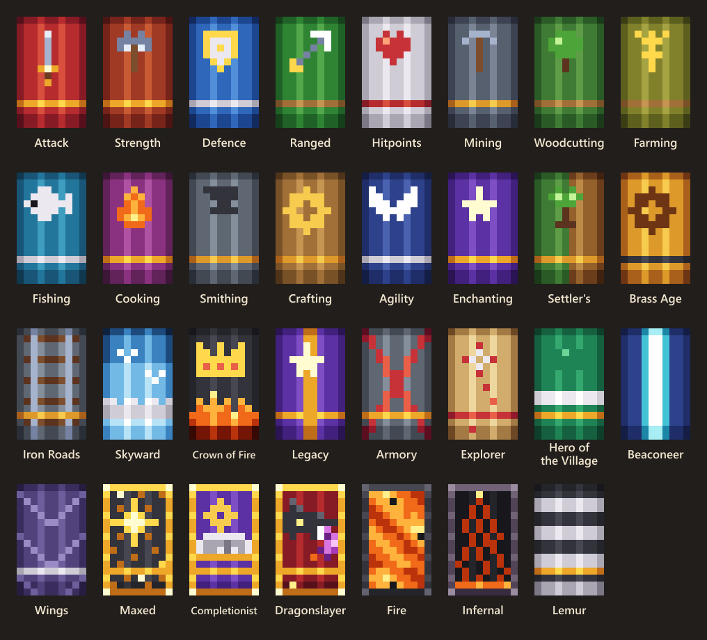
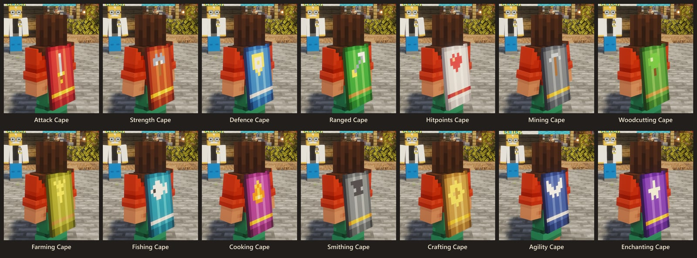
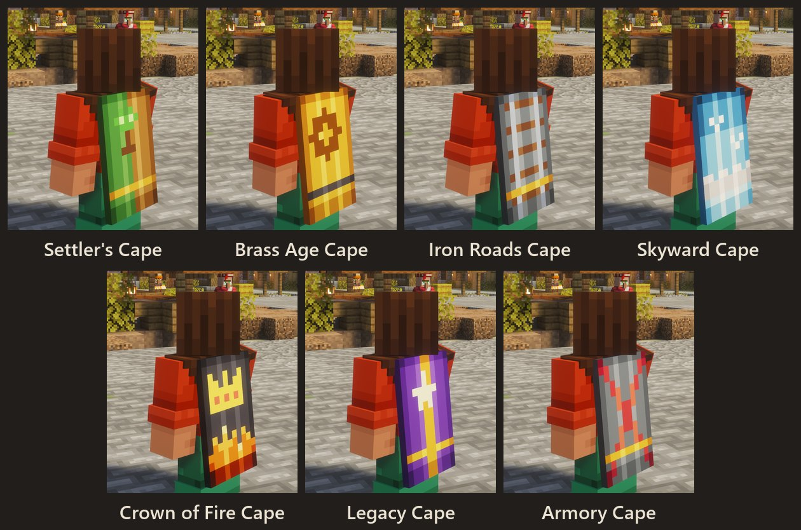
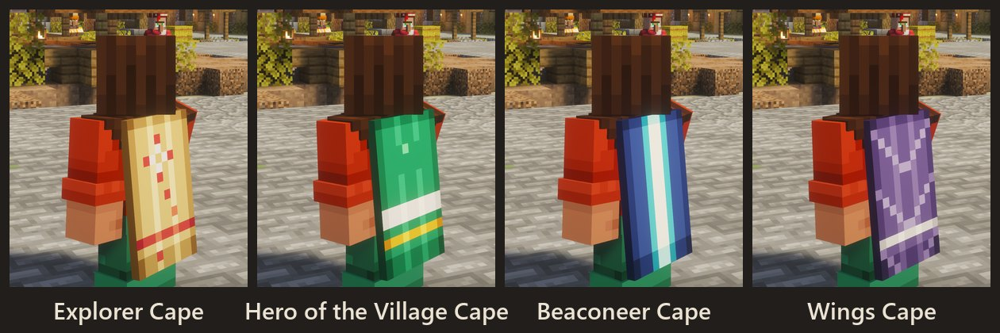
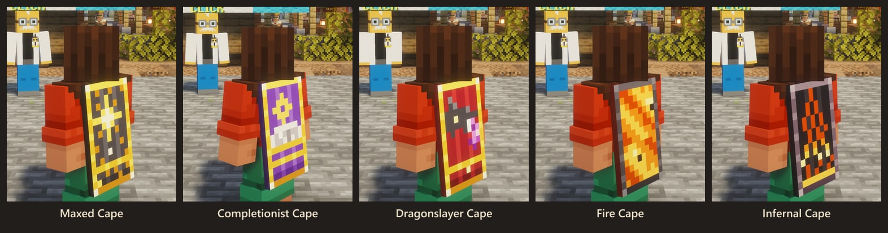
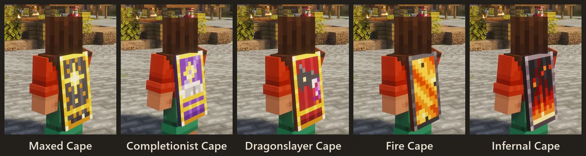
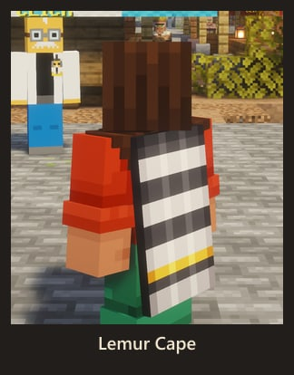

# Capes

<figure><figcaption>
Every cape there is to earn (the legendary ones move)
</figcaption></figure>

Capes are cosmetics you earn, not items: nothing to craft, nothing to lose. Everyone on the server sees the cape you wear. Some capes have a **perk** while worn; the legendary ones are **animated**.

**Wardrobe:** ESC → Capes, or `/capes`. It lists what you have unlocked; click a cape to wear it, or `/capes off` for none. Unlocks announce themselves in chat.

## Skill capes

One per skill, at level 99. Each has a perk while worn.

<figure><figcaption>
The skill capes, worn
</figcaption></figure>

| Cape | How to earn it | Perk |
|---|---|---|
| Attack Cape | Attack 99. | +5% crit chance |
| Strength Cape | Strength 99. | +10% crit damage |
| Defence Cape | Defence 99. | +2 armour |
| Ranged Cape | Ranged 99. | +5% crit chance |
| Hitpoints Cape | Hitpoints 99. | +1 heart |
| Mining Cape | Mining 99. | +15% dig speed |
| Woodcutting Cape | Woodcutting 99. | +25% Woodcutting XP from logs |
| Farming Cape | Farming 99. | 20% chance of double crop drops |
| Fishing Cape | Fishing 99. | +3 luck |
| Cooking Cape | Cooking 99. | eating heals 2 extra hearts |
| Smithing Cape | Smithing 99. | +1 armour toughness |
| Crafting Cape | Crafting 99. | the item in your hand mends one durability every ten seconds |
| Agility Cape | Agility 99. | +10% speed |
| Enchanting Cape | Enchanting 99. | +20% Enchanting XP |

## Quest capes

Finish a chapter of the quest book (its last quest hands the cape over).

<figure><figcaption>
The quest capes, worn
</figcaption></figure>

| Cape | How to earn it | Perk |
|---|---|---|
| Settler's Cape | Finish the Landfall chapter. | — |
| Brass Age Cape | Finish the Brass Age chapter. | — |
| Iron Roads Cape | Finish the Iron Roads chapter. | — |
| Skyward Cape | Finish the Skyward chapter. | — |
| Crown of Fire Cape | Finish the Crown of Fire chapter. | — |
| Legacy Cape | Finish the Legacy chapter. | +1 heart |
| Armory Cape | Finish the Armory chapter. | — |

## Achievement capes

Vanilla advancements that take real effort.

<figure><figcaption>
The achievement capes, worn
</figcaption></figure>

| Cape | How to earn it | Perk |
|---|---|---|
| Explorer Cape | Visit every Overworld biome (Adventuring Time). | — |
| Hero of the Village Cape | Save a village from a raid. | — |
| Beaconeer Cape | Build a full-power beacon. | — |
| Wings Cape | Find an elytra. | — |

## Legendary capes

Animated, and exceedingly hard to earn.

<figure><figcaption>
The legendary capes, worn
</figcaption></figure>

<figure><figcaption>
In motion
</figcaption></figure>

| Cape | How to earn it | Perk |
|---|---|---|
| Maxed Cape *(animated)* | Every skill at 99. | +5% crit chance, +5% crit damage, +1 heart |
| Completionist Cape *(animated)* | Every chapter of the quest book finished. | +10% speed |
| Dragonslayer Cape *(animated)* | Kill the Ender Dragon. | Fire Resistance |
| Fire Cape *(animated)* | Defeat the champion of the Fight Pits. | +12% crit damage, Fire Resistance |
| Infernal Cape *(animated)* | Survive the Inferno. | +20% crit damage, +5% crit chance, +1 heart, Fire Resistance |

## The owner's cape

Not earnable.

<figure><figcaption>
The the owner's cape, worn
</figcaption></figure>

| Cape | How to earn it | Perk |
|---|---|---|
| Lemur Cape | Given by the server owner. | — |

Generated from `capes/capes.mjs`, so this page matches the game.
