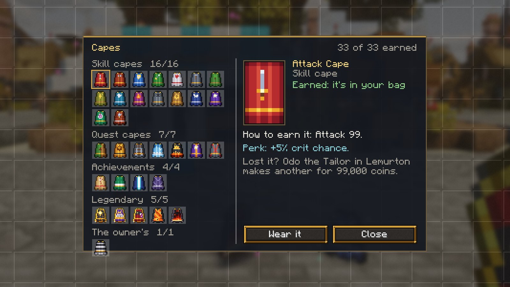
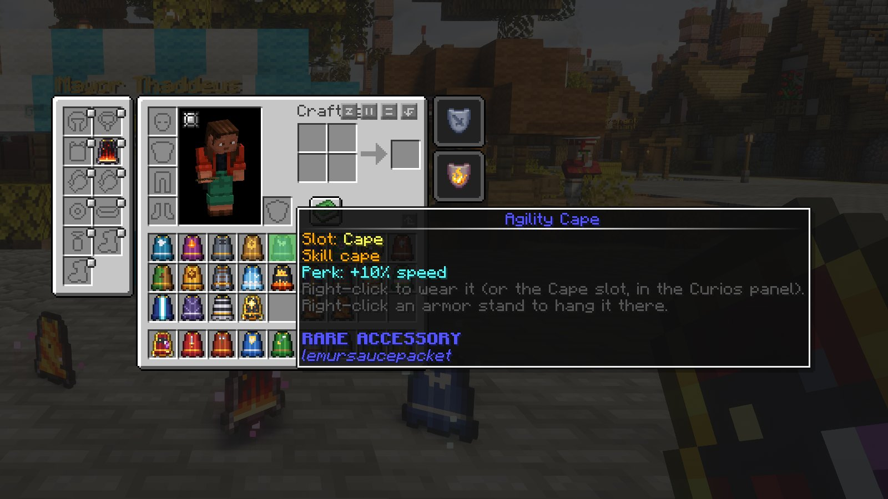
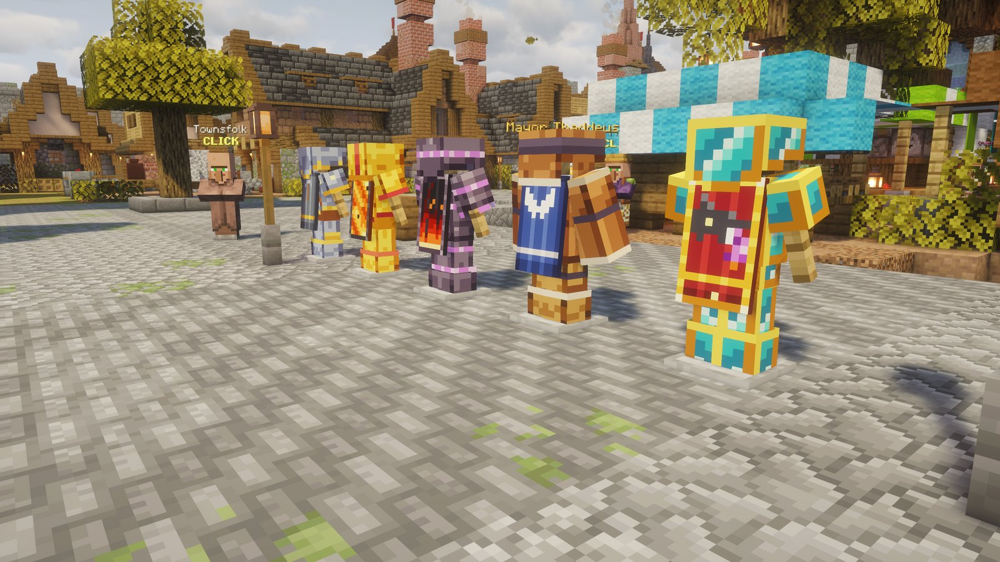

# Capes

<figure><figcaption>
Every cape there is to earn (the legendary ones move)
</figcaption></figure>

Capes are items you earn. When you earn one it goes into your bag. Everyone on the server sees the cape you wear; some have a **perk** while worn, and the legendary ones are **animated**.

- **Wear it:** right-click the cape, or put it in the **Cape** slot of the Curios panel in your inventory. The eye on the slot hides it without taking it off. Only someone who has earned a cape can wear it.
- **Show it off:** right-click an **armor stand** with a cape to hang it there (the one already on it comes back to you). Sneak and right-click the stand with an empty hand to take it back. A broken stand drops its cape. Any cape can go on a stand, earned or not.
- **Your collection:** ESC → Capes, or `/capes`. Every cape there is: the ones you have, how to earn the rest (with how far along you are), each perk, and where to get another if you lose one. It also puts a cape from your bag on, or takes yours off.

<figure><figcaption>
ESC → Capes: your collection
</figcaption></figure>

<figure><figcaption>
The Cape slot in the Curios panel, and a cape's tooltip
</figcaption></figure>

<figure><figcaption>
Capes on armor stands
</figcaption></figure>

Unlocks announce themselves in chat. On death a cape goes where the rest of your things go (your grave).

## Skill capes

One per skill, at level 99. Each has a perk while worn.

<figure><figcaption>
The skill capes, worn
</figcaption></figure>

| Cape | How to earn it | Perk |
|---|---|---|
| Attack Cape | Attack 99. | +5% crit chance |
| Strength Cape | Strength 99. | +10% crit damage |
| Defence Cape | Defence 99. | +2 armour |
| Ranged Cape | Ranged 99. | +5% crit chance |
| Hitpoints Cape | Hitpoints 99. | +1 heart |
| Mining Cape | Mining 99. | +15% dig speed |
| Woodcutting Cape | Woodcutting 99. | +25% Woodcutting XP from logs |
| Farming Cape | Farming 99. | 20% chance of double crop drops |
| Fishing Cape | Fishing 99. | +3 luck |
| Cooking Cape | Cooking 99. | eating heals 2 extra hearts |
| Smithing Cape | Smithing 99. | +1 armour toughness |
| Crafting Cape | Crafting 99. | the item in your hand mends one durability every ten seconds |
| Agility Cape | Agility 99. | +10% speed |
| Enchanting Cape | Enchanting 99. | +20% Enchanting XP |
| Brewing Cape | Brewing 99. | potions you drink last half as long again |
| Construction Cape | Construction 99. | +1 block reach, and it comes with the Mason's Palette: as many of one decorative block as you like |

## Quest capes

Finish a chapter of the quest book (its last quest hands the cape over).

<figure><figcaption>
The quest capes, worn
</figcaption></figure>

| Cape | How to earn it | Perk |
|---|---|---|
| Settler's Cape | Finish the Landfall chapter. | — |
| Brass Age Cape | Finish the Brass Age chapter. | — |
| Iron Roads Cape | Finish the Iron Roads chapter. | — |
| Skyward Cape | Finish the Skyward chapter. | — |
| Crown of Fire Cape | Finish the Crown of Fire chapter. | — |
| Legacy Cape | Finish the Legacy chapter. | +1 heart |
| Armory Cape | Finish the Armory chapter. | — |

## Achievement capes

Vanilla advancements that take real effort.

<figure><figcaption>
The achievement capes, worn
</figcaption></figure>

| Cape | How to earn it | Perk |
|---|---|---|
| Explorer Cape | Visit every Overworld biome (Adventuring Time). | — |
| Hero of the Village Cape | Save a village from a raid. | — |
| Beaconeer Cape | Build a full-power beacon. | — |
| Wings Cape | Find an elytra. | — |

## Legendary capes

Animated, and exceedingly hard to earn.

<figure><figcaption>
The legendary capes, worn
</figcaption></figure>

<figure><figcaption>
In motion
</figcaption></figure>

| Cape | How to earn it | Perk |
|---|---|---|
| Maxed Cape *(animated)* | Every skill at 99. | +5% crit chance, +5% crit damage, +1 heart |
| Completionist Cape *(animated)* | Every chapter of the quest book finished. | +10% speed |
| Dragonslayer Cape *(animated)* | Kill the Ender Dragon. | Fire Resistance |
| Fire Cape *(animated)* | Defeat the champion of the Fight Pits. | +12% crit damage, Fire Resistance |
| Infernal Cape *(animated)* | Survive the Inferno. | +20% crit damage, +5% crit chance, +1 heart, Fire Resistance |

## The owner's cape

Not earnable.

<figure><figcaption>
The owner's cape, worn
</figcaption></figure>

| Cape | How to earn it | Perk |
|---|---|---|
| Lemur Cape | Given by the server owner. | — |

## Lost a cape?

Whoever makes a cape will make you another, as long as you earned it: speak to them and choose *I've lost a cape*. Your collection shows who makes each cape and what it costs.

| Cape | Who makes another | Coins |
|---|---|---|
| Any skill cape | Odo the Tailor in Lemurton | 99,000 |
| Settler's Cape, Brass Age Cape, Iron Roads Cape, Skyward Cape, Crown of Fire Cape, Legacy Cape, Armory Cape, Explorer Cape, Hero of the Village Cape, Beaconeer Cape, Wings Cape | Odo the Tailor in Lemurton | 25,000 |
| Maxed Cape, Completionist Cape, Dragonslayer Cape | Odo the Tailor in Lemurton | 250,000 |
| Fire Cape | Brakka the Smith at Kiln Hollow. Or win the Fight Pits again. | 150,000 |
| Infernal Cape | Brakka the Smith at Kiln Hollow. Or survive the Inferno again. | 500,000 |
| Lemur Cape | Ask the server owner | — |

Every win in the Fight Pits or the Inferno hands over another of its cape, so a lost Fire or Infernal Cape can also be won back.

Generated from `capes/capes.mjs`, so this page matches the game.
