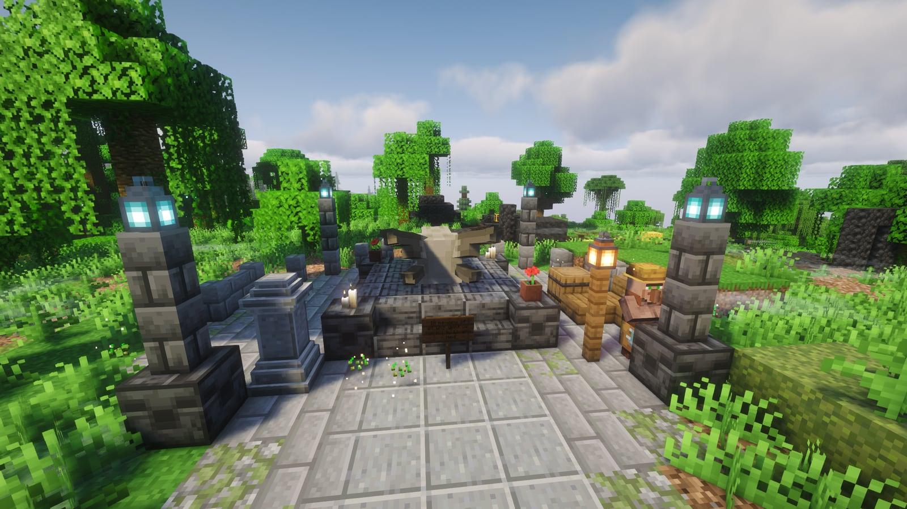
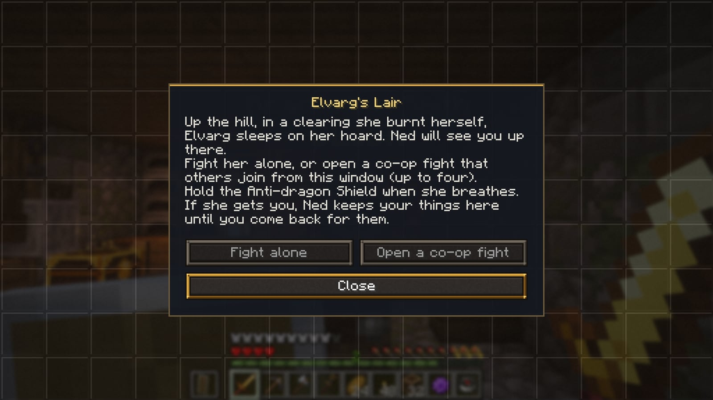
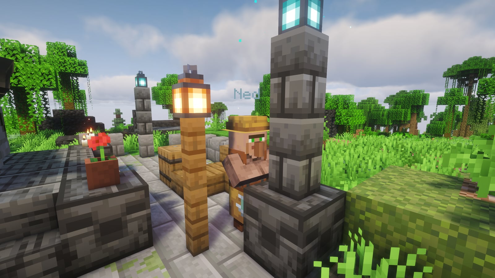
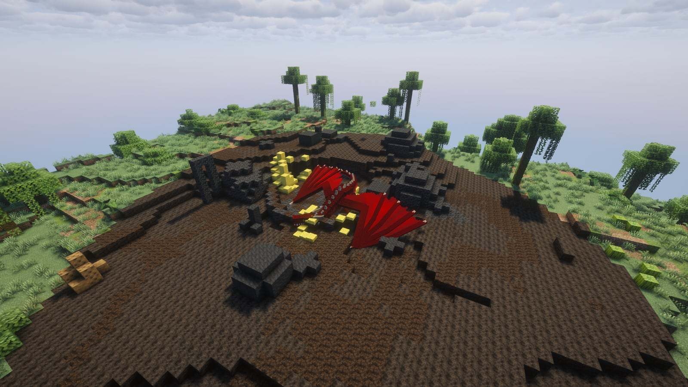
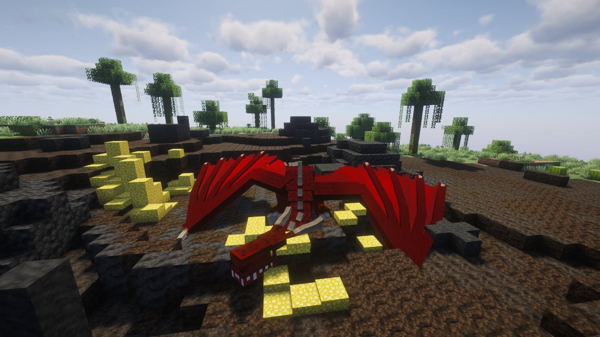

# Elvarg's Lair

Elvarg is the fire dragon at the end of [Dragon Slayer II](quests.md#main-quests), the quest Oziach gives you after you slay the Ender Dragon in Dragon Slayer I. She doesn't fly about the world: she sleeps on her hoard on the isle of Crandor, and every party that goes up to fight her gets **its own copy of her lair**. So she's always there for whoever needs the fight, and nobody can steal your kill.

## Getting there

1. Finish **Dragon Slayer I**: the Ender Dragon (see [Quests](quests.md#main-quests)). Keep the Anti-dragon Shield the mayor gave you for it, and bottle two lots of her breath while you're on her island.
2. Oziach gives you **Dragon Slayer II**. Bring **Wizard Traiborn** the two bottles of dragon's breath and eight blaze powder, and he scries the isle: his **Map to Crandor** is a compass that points to the memorial at the foot of Elvarg's hill.
3. At the memorial, **touch its waystone**, so you can come straight back after the fight, or after a bad one.

<figure><figcaption>
The Crandor memorial at the foot of Elvarg's hill
</figcaption></figure>

## Ned and his window

**Ned**, an old sailor, stands at the memorial. Right-click him and his window opens:

- **Fight alone** takes you up straight away.
- **Open a co-op fight** opens a lobby that others join from the same window. You see who has joined, and press **Begin** when you're ready. Up to four of you, host included.
- **Join *someone*'s fight** appears for every co-op fight that's open at the memorial.

Only the host needs to be on the quest (with the Map to Crandor, and Elvarg not yet slain): helpers can come along whatever their own progress. A lobby closes after five minutes, or when its host leaves; members can leave it, and the host can call it off.

<figure><figcaption>
Ned
</figcaption></figure>

## The fight

The party arrives on her hilltop, in a clearing she has burnt for herself, facing her. A health bar for Elvarg sits at the top of the screen.

<figure><figcaption>
Elvarg's Lair
</figcaption></figure>


**Hold the Anti-dragon Shield.** In either hand it lets through only a fifth of her breath, and her fire won't catch on you. Without it, her breath burns through armour fast.


- She has about **327 health** and fights in the air and on the ground: breath from a distance, bites up close.
- You have **20 minutes**. When time runs out, everyone still inside is taken back where they set out from.
- The lair has rules of its own: you can't break or place blocks, use buckets, blow anything up, or ender-pearl or chorus out of it. Anyone who strays too far from the hilltop, or falls off, is brought back, and so is she.
- `/instance leave` takes you out early.

<figure><figcaption>
Elvarg
</figcaption></figure>

## When she falls

Everyone in the fight with the map gets **Elvarg's Head**. You then have **a minute and a half** to loot her body before the party is taken back to where it set out from. Bring the head to Oziach to finish Dragon Slayer II and earn the right to wear dragon armour.

## If she gets you


**Nothing drops and nothing goes into a grave.** Everything you were carrying (inventory, armour, Curios slots) and your lifesteal Heart go to Ned at the memorial instead. A message in chat tells you so.


Back at the memorial, speak to Ned and press **Take back your things**: your armour goes back on, the rest into your inventory, and anything that doesn't fit stays with him until you make room. Then try again.

## Good to know

- If you log out during a fight, you're out of it; the next time you log in you're sent back to where you set out from.
- A server restart ends every fight in progress the same way.
- The lair is a copy: the real Crandor stays as it is, and the memorial keeps wild dragons away from itself.
