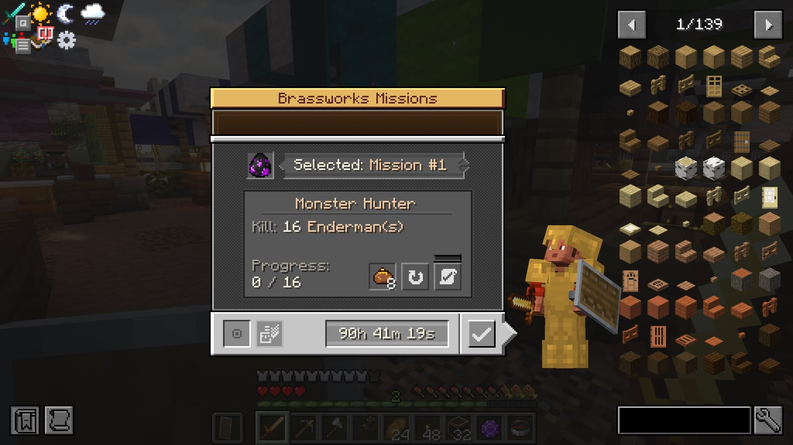
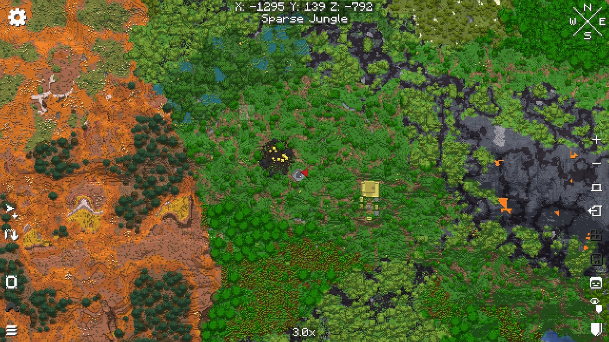

# The ESC menu

Pressing ESC opens a riveted board with three panels.

## Adventure (left)

| Button | Opens | Key |
|---|---|---|
| Map | Xaero's world map | M |
| Quests | The quest book | — |
| Missions | This week's Brassworks missions | H |
| Waypoints | Your Xaero waypoints | U |
| Capes | Your [cape](capes.md) collection: every cape, how to earn it, and where to get another if you lose one | `/capes` |

Between the buttons: your coordinates, the time and the biome you're in.

<figure><figcaption>
This week's missions (Missions, or H)
</figcaption></figure>

<figure><figcaption>
The world map (Map, or M)
</figcaption></figure>

## Game menu (middle)

Every normal pause-menu button: Back to Game, Settings, Mods, Advancements, Statistics, Player Reporting, Give Feedback, Report Bugs, Disconnect. Buttons other mods add appear in the free slots or in the small tray under Disconnect.

Bottom right: **HUD Layout** (see below).

## HUD Layout

Moves and resizes the parts of your screen that other mods draw. The game stays visible behind a light shade, with a brass box over each part:

- the minimap
- Jade (the block and mob info at the top)
- the voice chat icon and the voice group heads
- Create's goggle info
- Project MMO's XP gains and skill list
- pinned quests
- status effects and boss bars

Drag a box to move it. Boxes snap to the screen edges and centre lines; hold Shift to place one freely. Arrow keys nudge the box you clicked. Right-click a box, or click it and press **Reset**, to put it back where its mod puts it; **Reset all** does every box. **Save** applies the new layout at once, **Cancel** (or Esc) leaves everything as it was.

To resize a box, drag its corner handle, roll the mouse wheel over it, or click it and press **+** or **-**: from half its mod's size to two and a half times it, in 5% steps (Jade to twice). Its tooltip shows the size. The minimap keeps its own size setting (Xaero's UI scale, in its settings).

Pinned quests can only sit at an edge or a corner, so that box jumps to the nearest one when you let go. A box marked "(off)" belongs to something that's switched off in its mod; you can still move it.

The editor hides the live HUD and shows sample content inside each part while you place it. Drag to move, press **H** or use **Show/Hide** to stage visibility, then **Save**. **Cancel** discards both kinds of changes. Positions and visibility are saved in each mod's own settings, so your layout stays through pack updates. Also: `/hudlayout`, or bind **Edit HUD layout** under Controls > LemurSaucePacket.

## Player (right)

Your character as you look right now, then:

| Button | Opens | Key |
|---|---|---|
| Skills | Every skill and your level: hover one for what trains it and what it unlocks next, click it for what every level unlocks ([more](skills.md#the-skills-screen)) | `/skills` |
| Backpack | The backpack you're wearing | B |
| Team | FTB Teams: invite friends, share quest progress | ; |
| Voice | Voice chat settings, groups and your microphone | V |
| Guide | This wiki, in a browser inside the game; **Open in browser** opens it in yours | `/guide` (the book) |
