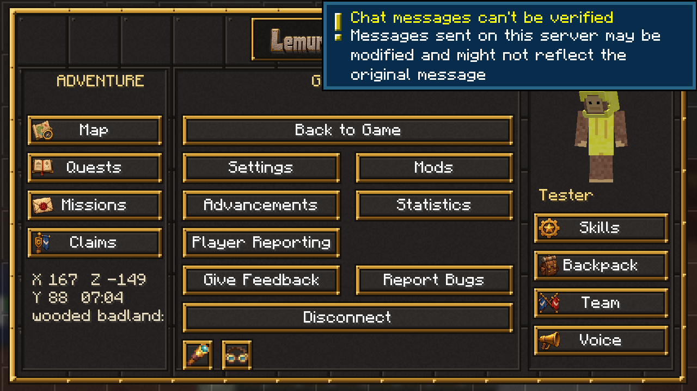

# The ESC menu

Pressing ESC opens a riveted board with three panels.

## Adventure (left)

| Button | Opens | Key |
|---|---|---|
| Map | Xaero's world map | M |
| Quests | The quest book | — |
| Missions | This week's Brassworks missions | H |
| Waypoints | Your Xaero waypoints | U |
| Capes | Your wardrobe: the [capes](capes.md) you've earned | `/capes` |

Between the buttons: your coordinates, the time and the biome you're in.

## Game menu (middle)

Every normal pause-menu button: Back to Game, Settings, Mods, Advancements, Statistics, Player Reporting, Give Feedback, Report Bugs, Disconnect. Buttons other mods add appear in the free slots or in the small tray under Disconnect.

Bottom right: **HUD Layout** (see below).

## HUD Layout

Moves the parts of your screen that other mods draw. The game stays visible behind a light shade, with a brass box over each part:

- the minimap
- Jade (the block and mob info at the top)
- the voice chat icon and the voice group heads
- Create's goggle info
- Project MMO's XP gains and skill list
- pinned quests
- status effects and boss bars

Drag a box to move it. Boxes snap to the screen edges and centre lines; hold Shift to place one freely. Arrow keys nudge the box you clicked. Right-click a box, or click it and press **Reset**, to put it back where its mod puts it; **Reset all** does every box. **Save** applies the new layout at once, **Cancel** (or Esc) leaves everything as it was.

Pinned quests can only sit at an edge or a corner, so that box jumps to the nearest one when you let go. A box marked "(off)" belongs to something that's switched off in its mod; you can still move it.

Each position is saved in that mod's own settings, so your layout stays through pack updates. Also: `/hudlayout`, or bind **Edit HUD layout** under Controls > LemurSaucePacket.

## Player (right)

Your character as you look right now, then:

| Button | Opens | Key |
|---|---|---|
| Skills | Your inventory, whose skills panel lists every skill and level | E |
| Backpack | The backpack you're wearing | B |
| Team | FTB Teams: invite friends, share quest progress | ; |
| Voice | Voice chat settings, groups and your microphone | V |
| Guide | This wiki as an in-game book | `/guide` |
