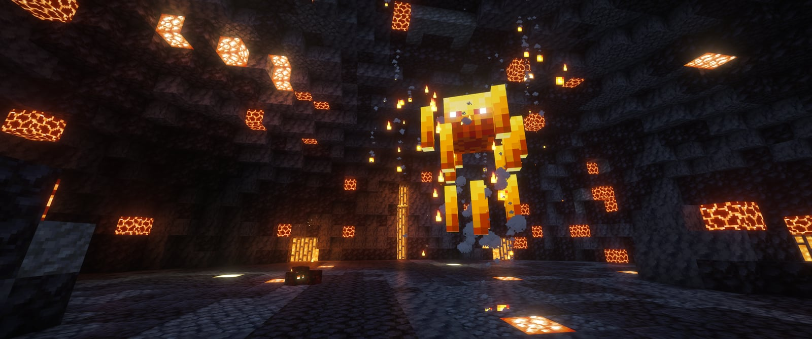
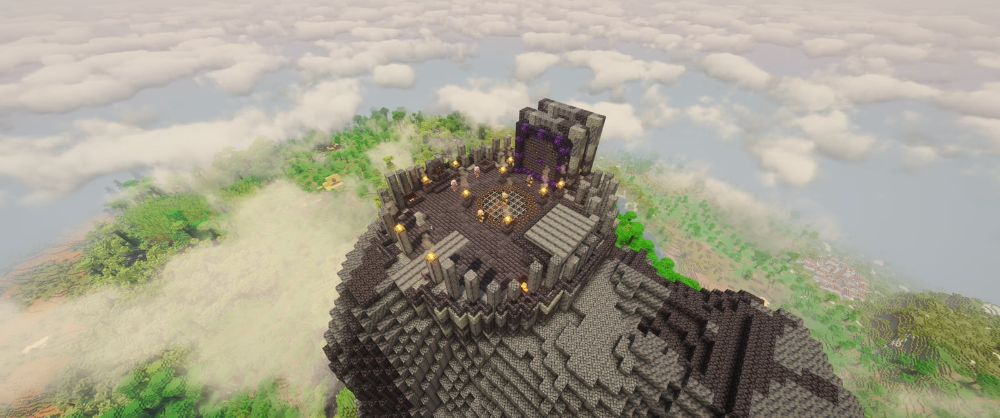
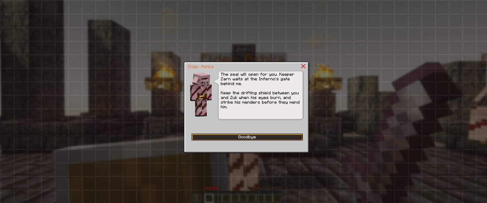
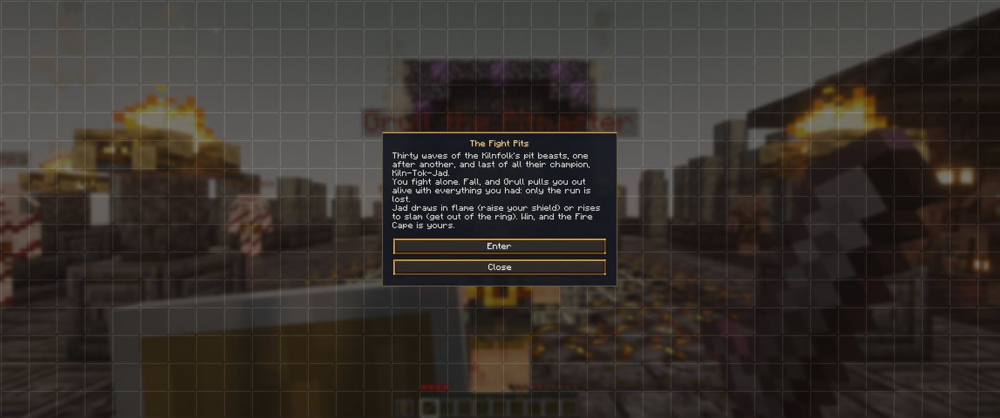
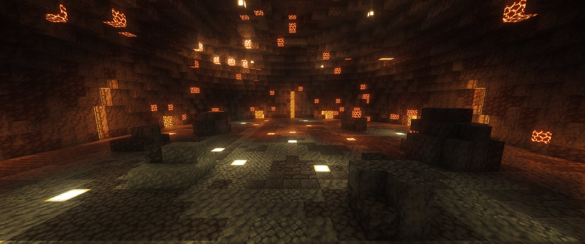
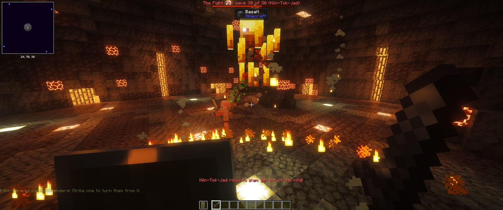
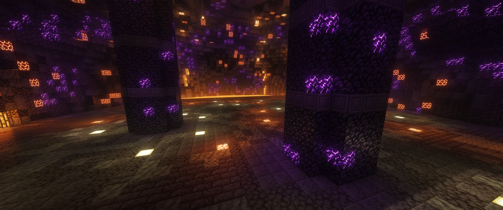
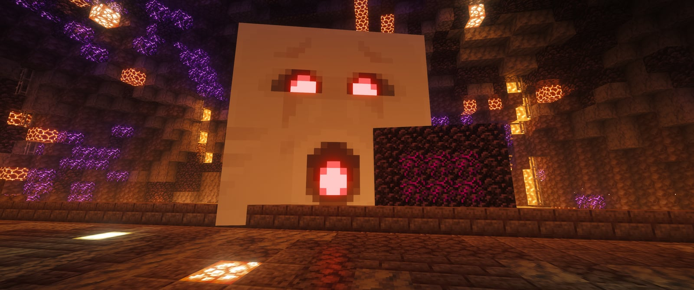

# The Fight Pits and the Inferno

The **Kilnfolk** are ashen piglins who left the Nether long ago for the fire mountains of the Overworld. Their champions prove themselves in the **Fight Pits**, thirty waves of pit beasts with **Kiln-Tok-Jad** at the end, and the best of them in the **Inferno** below it, where **Kiln-Kal-Zuk** waits behind his shield. Win and you earn the two best capes in the pack: the **Fire Cape** and the **Infernal Cape**.

It's our take on RuneScape's Fight Cave and Inferno, with Minecraft's own creatures standing in for the TzHaar's.

<figure><figcaption>
Kiln-Tok-Jad draws in flame
</figcaption></figure>


Both are solo and instanced: every run gets a pit of its own, so nobody can join in or steal it. **If you fall, you're pulled out alive with everything you had**: no drop, no grave, no Heart lost. Only the run is lost.


## Kiln Hollow

The Kilnfolk's outpost stands in the volcanic lands nearest Lemurton (a volcanic crater or peak, or failing those basalt cliffs, an ashen savanna or badlands). It's a plaza of blackstone cut into the rock: the grated mouth of the Fight Pits in the middle, the sealed gate of the Inferno behind it, a waystone by the way in, and a safe zone like Lemurton's.

<figure><figcaption>
Kiln Hollow, on a volcano above the clouds
</figcaption></figure>

| Who | Where | What for |
|---|---|---|
| **Elder Ashka** | On her seat of blackstone and gold (west) | The quests: she decides who goes in |
| **Grull the Pitmaster** | At the pit mouth | Right-click: the Fight Pits |
| **Keeper Zarn** | At the Inferno's gate | Right-click: the Inferno |
| **Brakka the Smith** | At his forge (east) | Obsidian, blackstone, fire charges, Fire Resistance, arrows and shields for coins; he forges the Infernal Key |

The **Kilnfolk Pass**, which Guildmaster Greaves gives you, is a compass that points to Kiln Hollow. Touch the waystone when you get there.

<figure><figcaption>
Elder Ashka
</figcaption></figure>

## Getting in

Three main quests, one after another (they show up in your book under **Main Quests** once someone gives them to you; see [Quests](quests.md#main-quests)):

1. **The Fight Pits** (after [Dragon Slayer I](quests.md#main-quests), the Ender Dragon): Guildmaster Greaves gives you the Kilnfolk Pass. At Kiln Hollow, Elder Ashka wants three things before she vouches for you:
   * an **offering** for the Kiln: 8 magma cream, 4 blaze rods and 16 obsidian;
   * the **Ashen Trial**: 15 blazes, 15 magma cubes and 8 wither skeletons, in the Nether (the quest book counts them);
   * the strength the pits ask: **Defence 50, Hitpoints 50, and Attack or Ranged 50**.

   Then Grull lets you in. Win, and show the Elder your Fire Cape.
2. **Ashes of the Kiln** (after the Fire Cape): slay the **Wither and the Warden**, and finish **Dragon Slayer II** ([Elvarg](elvarg.md)); have Brakka forge an **Infernal Key** from a nether star, 4 netherite ingots, 16 crying obsidian and 16 blaze rods; and grow to **Defence 80, Hitpoints 80, and Attack or Ranged 80**. Give the Elder the key.
3. **The Inferno**: Keeper Zarn opens the seal. Win, and show the Elder your Infernal Cape.

## How a wave fight works

<figure><figcaption>
Grull's window
</figcaption></figure>

* Right-click Grull (or Zarn) and press **Enter**. You arrive on the south side of the pit, facing in.
* The waves come one after another: each a few seconds after the last beast of the one before falls (including what it split into or called up). The bar at the top counts them; on the last wave it follows the boss.
* Beasts come in from all round the pit. Use the boulders (and in the Inferno, the pillars) to break their line of sight.
* You have 90 minutes in the Fight Pits and two hours in the Inferno. `/instance leave` walks out early.
* Win and you have 20 seconds before you're taken back. You can fight again any time for the coins (10,000 a win in the Fight Pits, 40,000 in the Inferno); each cape only comes once.

## The Fight Pits

| Beast | What it is | What it does |
|---|---|---|
| **Kiln-Kih** | A small magma cube | Embers: quick and weak |
| **Kiln-Kek** | A big magma cube | Splits into embers when it dies |
| **Kiln-Xil** | A wither skeleton with a bow | Shoots flaming arrows from range |
| **Kiln-MejKot** | A piglin brute | Hits hard, and heals the beasts round it: kill it first |
| **Kiln-Zek** | A big blaze | Throws fire that Fire Resistance doesn't stop |
| **Kiln-Tok-Jad** | A giant blaze | The champion: see below |

Waves 1 to 6 are Kih and Kek, 7 to 12 bring in the Xil, 13 to 19 the MejKot, 20 to 29 the Zek, and wave 30 is Kiln-Tok-Jad alone.

<figure><figcaption>
The Fight Pits
</figcaption></figure>

### Kiln-Tok-Jad

Jad drifts toward you and attacks every four seconds. Every attack is telegraphed, and the line above your hotbar says which:

* **Fire volley**: flames gather in his maw. **Raise your shield toward him** (it has to be up a moment before he fires). If it isn't, about two thirds of your health goes, through armour and Protection.
* **Slam**: he rises, and a ring of fire burns round where you stand. **Get out of the ring** before he comes down. Inside it, more than half your health goes and you're thrown up.

<figure><figcaption>
His menders
</figcaption></figure>

At half health he calls **four menders** (Kiln-HurKot, zombified piglins) who walk to him and heal him. **Strike one** and they all turn on you instead, as zombified piglins do. Then they're just four more beasts to deal with, and Jad is yours.


Bring a shield (the Anti-dragon Shield works), food, healing and Strength potions, golden apples (their absorption hearts soak up a hit) and a bow for the Xil. Fire Resistance helps against burning and lava, but not against the hits themselves.


## The Inferno

Twenty-six waves of the Kal- beasts, each with a swarm of Nib in it, then a **Kal-Tok-Jad**, then **two at once**, then **Kiln-Kal-Zuk**.

<figure><figcaption>
The Inferno
</figcaption></figure>

| Beast | What it is | What it does |
|---|---|---|
| **Kal-Nib** | A vex | Swarms of three in every wave |
| **Kal-MejRah** | A phantom | Drains your run: Slowness and Hunger when it hits |
| **Kal-Ak** | A great magma cube | Splits, and splits again |
| **Kal-ImKot** | A hoglin | Burrows up beside you when it can't get closer |
| **Kal-Xil** | A wither skeleton with a stronger bow | Shoots from range |
| **Kal-Zek** | An evoker | Fangs, and calls up vexes |
| **Kal-Tok-Jad** | A giant blaze | Jad again, with three menders at half health |

### Kiln-Kal-Zuk

Zuk hangs over the lava lake on the north side, and a **shield** of obsidian and crying obsidian drifts back and forth along its shore.

<figure><figcaption>
His eyes burn: get behind the shield
</figcaption></figure>

* Every few seconds **his eyes burn** (his face opens and he wails). Then he burns everyone the shield doesn't cover: **be behind the shield**, on the line between you and him, or nine tenths of your health goes.
* He's close enough to the shore to hit from right behind the shield, so you can fight him as it drifts, keeping it between you. With a bow you can shoot from anywhere behind it.
* At four fifths and three fifths of his health he sends a Kal-Xil and a Kal-Zek; at half, a Kal-Tok-Jad; at a quarter, three menders (Kal-MejJak) who walk to the shore to heal him. Strike one.
* Near the end he burns more often.

## The capes

| Cape | Won in | Perks |
|---|---|---|
| **Fire Cape** | The Fight Pits | +12% critical damage, Fire Resistance |
| **Infernal Cape** | The Inferno | +20% critical damage, +5% critical chance, +1 heart, Fire Resistance |

Both are animated: lava pours down the Fire Cape, and the Infernal Cape's cracks pulse from a molten core. Wear them from the [cape menu](capes.md).

<figure><figcaption>
The animated capes: the Fire Cape and the Infernal Cape on the right
</figcaption></figure>

## For admins

* `/lsp kiln where`: where Kiln Hollow is (or its land, before it's built); `/lsp kiln goto <player>`; `/lsp kiln pass <player>`.
* `/instances start lemursaucepacket:fight_pits <player>` (or `lemursaucepacket:inferno`) starts a run without the quests; `/instances wave <run> <wave>` jumps a run to a wave (run 0 is the one you are in); `/instances list` shows the runs.
