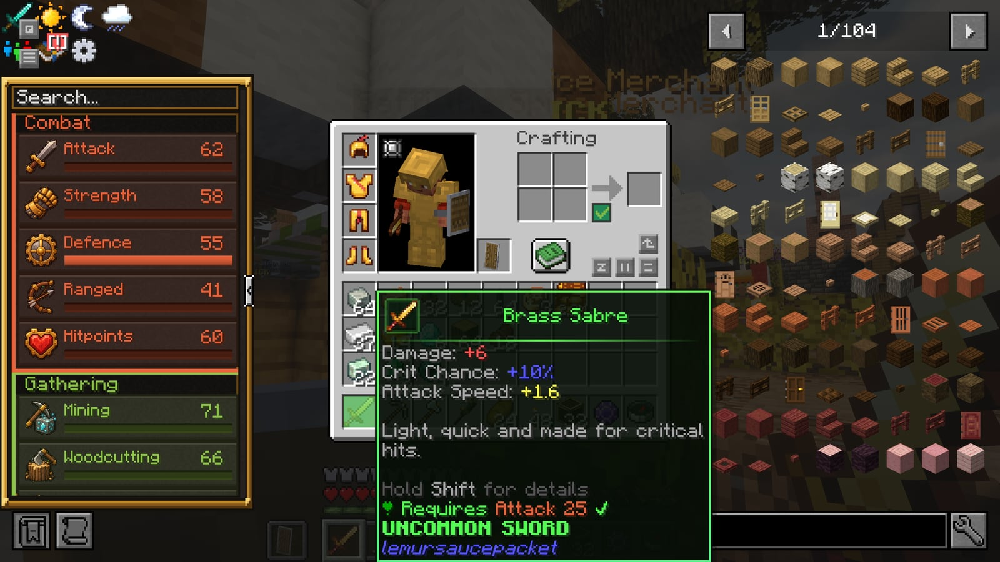
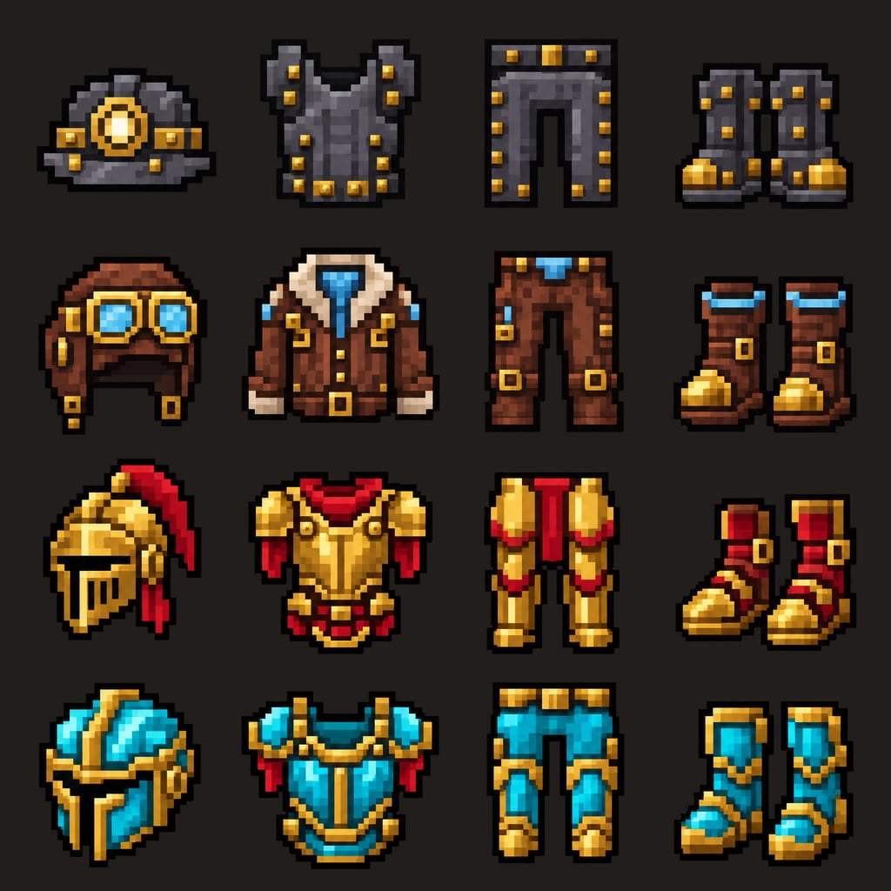

# Gear

<figure><figcaption>
Every piece shows its rarity, stats and the skill level it needs
</figcaption></figure>

The pack's own tools, weapons and armour, made with Create and gated by [skills](skills.md). Every piece shows its stats and a "How to get" line in its tooltip, and JEI has the same "how to get" text on the item's information page (the `i` tab next to its recipes; press R on any item).

Stats: **Damage**, **Attack Speed**, **Crit Chance** (added to the Strength/Ranged crit roll), **Crit Damage** (added to the 1.5× critical multiplier), **Defense**, **Toughness**, **Health**, **Speed**, **Luck**. Perks are named effects a piece has on its own; a **full set** bonus needs all four pieces; a **synergy** is a Relics item that makes a full set stronger.

## Armour sets

<figure><figcaption>
Prospector, Aeronaut, Brass Duelist and Compacted Diamond
</figcaption></figure>

### Prospector's Set

Mining utility: light where you dig, haste when you commit to the whole set.

Wear: Mining 35. Defense 2/6/5/2, toughness 0.

| Piece | Stats and perk |
|---|---|
| Prospector's Lamp | Night Vision below Y=32 (alone too) |
| Prospector's Vest | — |
| Prospector's Trousers | — |
| Prospector's Boots | — |

**Full set:** Haste I, and a 15% chance of double ore drops. **With the clot of time:** Haste II instead of Haste I.

**How to get:** Mechanical crafting from brass casings, andesite alloy and a lamp.

### Aeronaut's Set

Mobility for people who live on airships and rooftops.

Wear: Agility 40. Defense 2/5/4/2, toughness 0.

| Piece | Stats and perk |
|---|---|
| Aeronaut's Goggles | — |
| Aeronaut's Jacket | — |
| Aeronaut's Trousers | — |
| Aeronaut's Boots | No fall damage (alone too) |

**Full set:** +15% speed, step up whole blocks, swim faster. **With the kinetic belt:** another +10% speed.

**How to get:** Mechanical crafting from leather, propeller parts and sturdy sheets.

### Brass Duelist Set

Fighting armour: every piece sharpens your criticals.

Wear: Attack 40. Defense 3/7/5/3, toughness 1.

| Piece | Stats and perk |
|---|---|
| Duelist Helm | ☣ Crit Chance +2% |
| Duelist Cuirass | ☣ Crit Chance +2% |
| Duelist Greaves | ☣ Crit Chance +2% |
| Duelist Sabatons | ☣ Crit Chance +2% |

**Full set:** +10% crit chance and +25% crit damage. **With the ring of the seven deadly sins:** another +15% crit damage.

**How to get:** Mechanical crafting from brass plates, precision mechanisms and a duelist's pattern.

### Compacted Diamond Set

Heavy plate pressed from compacted diamond.

Wear: Defence 45. Defense 4/9/7/4, toughness 3, knockback resistance 0.1.

| Piece | Stats and perk |
|---|---|
| Compacted Diamond Helmet | — |
| Compacted Diamond Chestplate | — |
| Compacted Diamond Leggings | — |
| Compacted Diamond Boots | — |

**Full set:** Bulwark: 10% less damage from everything.

**How to get:** Press diamonds into compacted diamond (basin + mechanical press), then mechanical crafting.

### Compacted Netherite Set

The last armour you will need.

Wear: Defence 60. Defense 5/10/8/5, toughness 4, knockback resistance 0.2.

| Piece | Stats and perk |
|---|---|
| Compacted Netherite Helmet | — |
| Compacted Netherite Chestplate | — |
| Compacted Netherite Leggings | — |
| Compacted Netherite Boots | — |

**Full set:** +4 hearts and Bulwark.

**How to get:** Compacted netherite (basin + press) and smithing over compacted diamond.

## Single pieces

| Piece | Slot | Stats and perk | Wear | How to get |
|---|---|---|---|---|
| Angler's Cap | helmet | ✦ Luck +2; +2 Luck: better catches and better loot | Fishing 25 | Crafted from leather, string and a fishing rod. |
| Ember Crown | helmet | Fire Resistance while worn, +1 damage | Defence 40 | Only found in Nether fortress and bastion chests. |

## Weapons

| Weapon | Damage | Attack speed | Extra | Wield | How to get |
|---|---|---|---|---|---|
| Brass Sabre | 6 | 2.0 | ☣ Crit Chance +10%; Fast, and +10% crit chance | Attack 25 | Mechanical crafting from brass ingots and a sturdy sheet. |
| Sturdy Warhammer | 11 | 0.8 | ➶ Knockback +1; Slow, heavy, sends things flying | Attack 45 | Mechanical crafting from sturdy sheets, a precision mechanism and a shaft. |
| Stormcaller's Sabre | 8 | 1.8 | ☣ Crit Chance +5%; One hit in ten shocks the target for 3 extra damage | Attack 50 | Only found in pillager outpost and Dungeons Arise chests. |

## Tools

| Tool | Does | Use | How to get |
|---|---|---|---|
| Lumber Axe | Chop one log and the whole tree comes down | Woodcutting 30 | Mechanical crafting from iron sheets, andesite alloy and a mechanical saw. |
| Excavator's Pickaxe | Mines a 3x3 (sneak for a single block) | Mining 40 | Mechanical crafting from iron sheets, a drill and brass. |
| Prospector's Pickaxe | Ores come out already smelted | Mining 30 | Mechanical crafting from iron sheets, a blaze burner and copper. |
| Harvester's Scythe | Right-click: harvests and replants a 5x5 of ripe crops | Farming 30 | Mechanical crafting from iron sheets, a mechanical harvester and a shaft. |
| Builder's Wand | Right-click a block face to extend it with matching blocks from your inventory (up to 32) | Crafting 30 | Mechanical crafting from brass, a precision mechanism and a schematicannon core. |

## Materials

| Material | How to get |
|---|---|
| Compacted Diamond | Four diamonds compacted in a basin under a mechanical press. |
| Compacted Netherite | Four netherite ingots compacted in a basin under a heated mechanical press. |
| Duelist's Pattern | Only found in Dungeons Arise chests; one pattern per set piece. |

## Loot-only gear

Some pieces never have a recipe:

- **Ember Crown**: 12% per chest in nether bridge, bastion treasure.
- **Stormcaller's Sabre**: 6% per chest in pillager outpost, dungeons_arise structures.
- **Duelist's Pattern**: 25% per chest in dungeons_arise structures, stronghold library, ancient city.

Generated from `gear/gear.mjs`, so this page matches the game.
