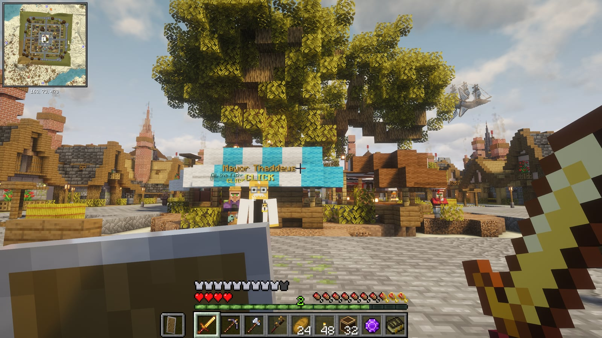

# Getting started

You need a Minecraft: Java Edition account, Windows 10 or 11 (64-bit) and about 8 GB of RAM to spare.

## 1. Install the launcher

Download the installer from [play.limas.ca](https://play.limas.ca) or the server's [releases page](https://github.com/lilman514/lemursaucepacket/releases/latest) (`LemurSaucePacket-Setup-x.y.z.exe`) and run it. It installs for your user only — no admin rights — and puts a shortcut on the desktop and in the Start menu.


If Windows says **"Windows protected your PC"**, click *More info*, then *Run anyway*. The installer isn't code-signed yet, so SmartScreen asks first.


## 2. Sign in

Press **Play**. The launcher asks you to sign in with the Microsoft account that owns Minecraft. Your browser opens Microsoft's page; enter the code the launcher shows if it asks for one. Your password never goes through the launcher.

<figure><figcaption>
The launcher's Home page
</figcaption></figure>

## 3. Play

Press **Play** again. The first time, the launcher downloads Minecraft, Java, NeoForge and every mod (a few minutes on a normal connection). After that it checks for updates in a second or two and drops you straight onto the server.

The server's address is **mc.limas.ca**. The launcher puts it in your multiplayer list for you, so you never have to type it.


The server keeps a whitelist. Ask an admin to add your Minecraft name before your first login.


If you'd rather see the title screen first, turn off *Join the server automatically* on the launcher's Settings page.

## What next

- Press **ESC** in-game: the menu is a hub for the map, quests, missions, skills, your backpack, your team and voice chat. See [The ESC menu](esc-menu.md).
- Open the quest book (ESC → Quests). The first chapter, *Landfall*, is the tutorial and pays coins.
- You start with the **LemurSaucePacket Guide**, this wiki as a book. ESC → Guide (or `/guide`) opens it anywhere; a book and a brass nugget craft another.
- Follow the **Compass to Lemurton** you get on your first login, and talk to Mayor Thaddeus for the first quest. See [Lemurton](lemurton.md).
- Read [The world and its rules](world.md) before you build anything you'd miss.

<figure><figcaption>
Your screen: the minimap at the top left, block and mob info at the top, hearts and hotbar at the bottom
</figcaption></figure>
