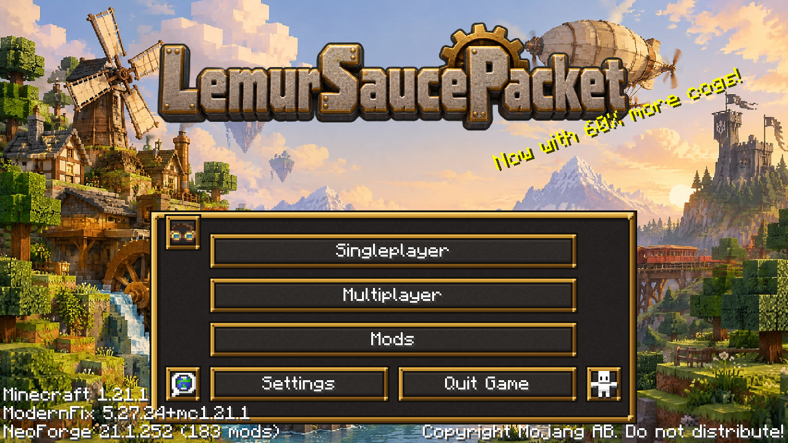

# Getting started

You need a Minecraft: Java Edition account, Windows 10 or 11 (64-bit) and about 8 GB of RAM to spare.

## 1. Install the launcher

Download the installer from the server's [releases page](https://github.com/lilman514/lemursaucepacket/releases/latest) (`LemurSaucePacket-Setup-x.y.z.exe`) and run it. It installs for your user only — no admin rights — and puts a shortcut on the desktop and in the Start menu.

## 2. Sign in

Press **Play**. The launcher asks you to sign in with the Microsoft account that owns Minecraft. Your browser opens Microsoft's page; enter the code the launcher shows if it asks for one. Your password never goes through the launcher.

## 3. Play

Press **Play** again. The first time, the launcher downloads Minecraft, Java, NeoForge and every mod (a few minutes on a normal connection). After that it checks for updates in a second or two and drops you straight onto the server.

If you'd rather see the title screen first, turn off *Join the server automatically* on the launcher's Settings page.

## What next

- Press **ESC** in-game: the menu is a hub for the map, quests, missions, skills, your backpack, your team and voice chat. See [The ESC menu](esc-menu.md).
- Open the quest book (ESC → Quests). The first chapter, *Landfall*, is the tutorial and pays coins.
- You start with the **LemurSaucePacket Guide**, this wiki as a book. ESC → Guide (or `/guide`) opens it anywhere; a book and a brass nugget craft another.
- Read [The world and its rules](world.md) before you build anything you'd miss.
