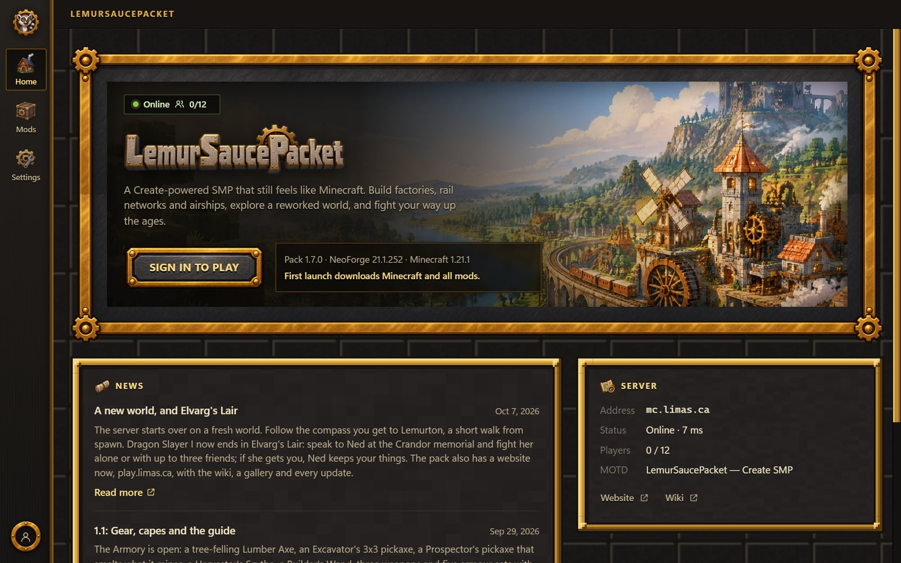
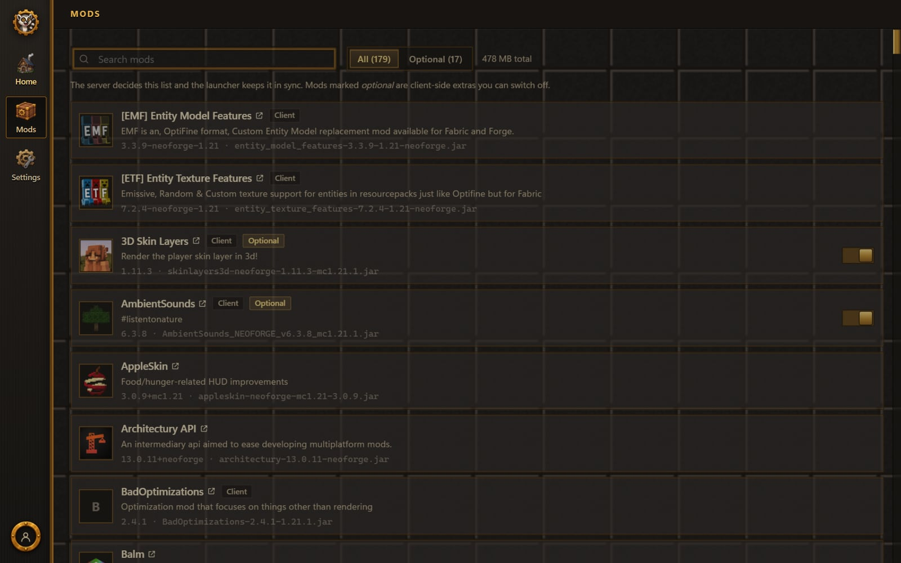
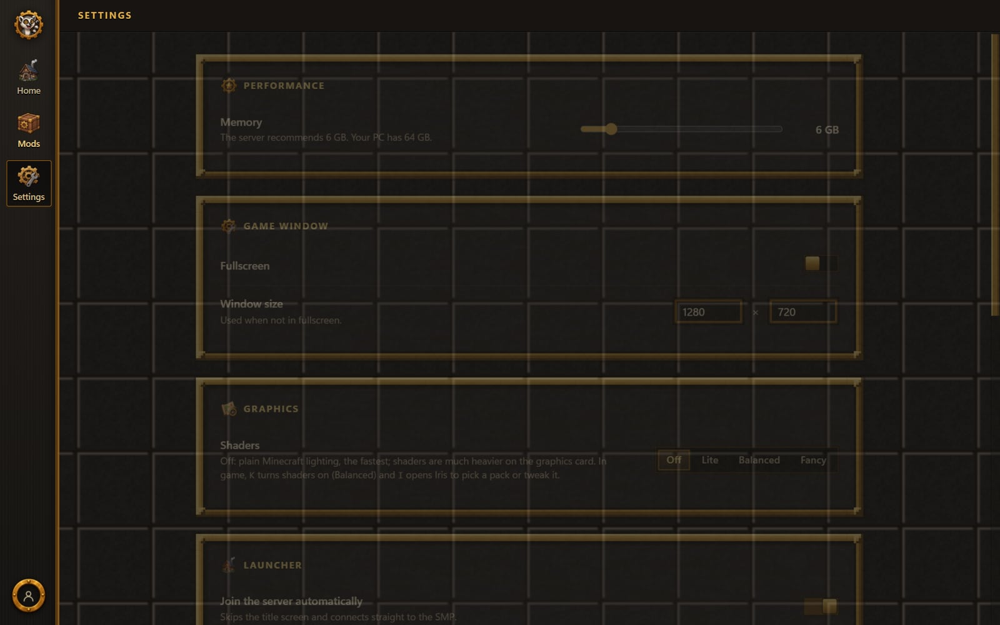

# The launcher

The launcher is the only thing you install. It keeps your mods identical to the server's, so "mismatched mods" can't happen, and it updates itself.

## Home

The Play button, the server's status and player list, and news from the pack's admins. When a pack update is out, the Play button says so and installs it before launching. The Website and Wiki buttons under the server's details open [play.limas.ca](https://play.limas.ca) and this wiki.

<figure><figcaption>
Home
</figcaption></figure>

## Mods

The full list of mods with a link to each one's Modrinth page. Mods marked **Optional** are client-side extras you can switch off (first-person model, controller support…). Everything else is required by the server.

<figure><figcaption>
Mods
</figcaption></figure>

## Settings

<figure><figcaption>
Settings
</figcaption></figure>

- **Memory:** how much RAM Minecraft gets. The server recommends 6 GB; more helps with shaders.
- **Window size / fullscreen.**
- **Shaders** (Graphics): Off, **Lite** (MakeUp Ultra Fast, for any PC), **Balanced** (Complementary Reimagined, keeps the Minecraft look) or **Fancy** (Complementary Unbound, realistic light and clouds, for strong graphics cards). Off by default. Shaders are always installed, so you can also flip them in game: **K** turns them on and off (Balanced unless you picked another pack) and **I** opens Iris to pick a pack or tweak it. A pick here applies next time you press Play; whatever you choose in game stays until you pick here again.
- **Join the server automatically:** skips the title screen.
- **When the game starts:** minimise, keep or close the launcher.
- **Java executable / JVM arguments:** leave empty unless you know why.
- **Files & repair:** opens the game, screenshots and logs folders. *Repair & play* re-checks every file and re-downloads anything damaged.

## Where things are

Everything lives in `%APPDATA%\LemurSaucePacket`: `instance` is the game folder (screenshots, logs, options), `minecraft` and `runtime` are the game and Java files it manages.

## Updates

The launcher checks GitHub Releases on start. When a new version has downloaded, a "Restart to update" chip appears in the title bar.
