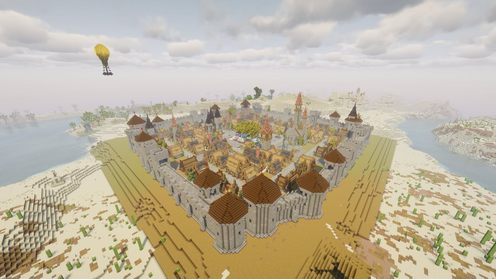
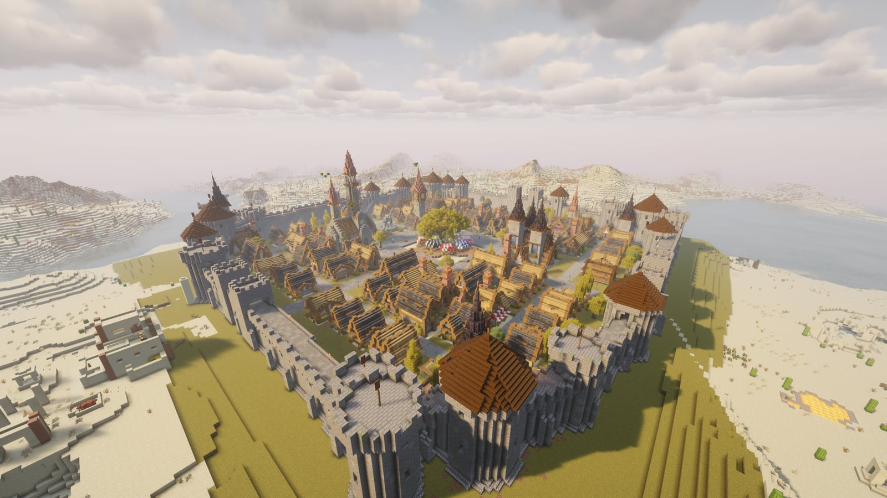
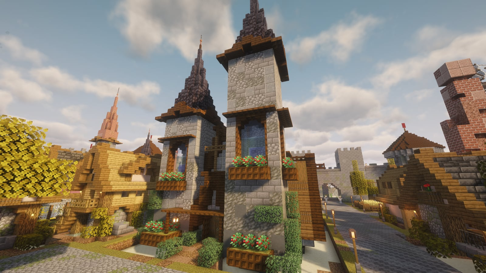
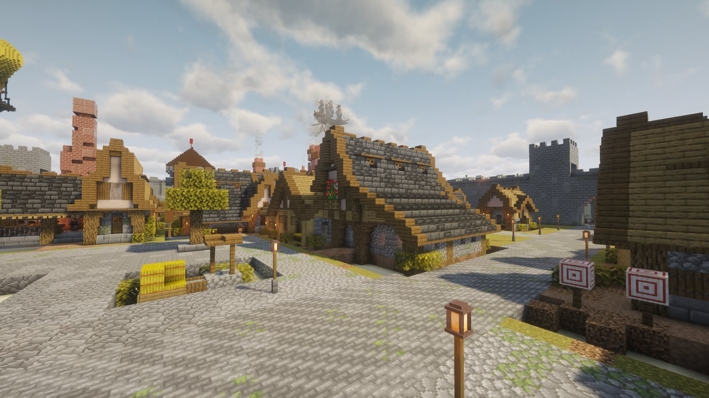
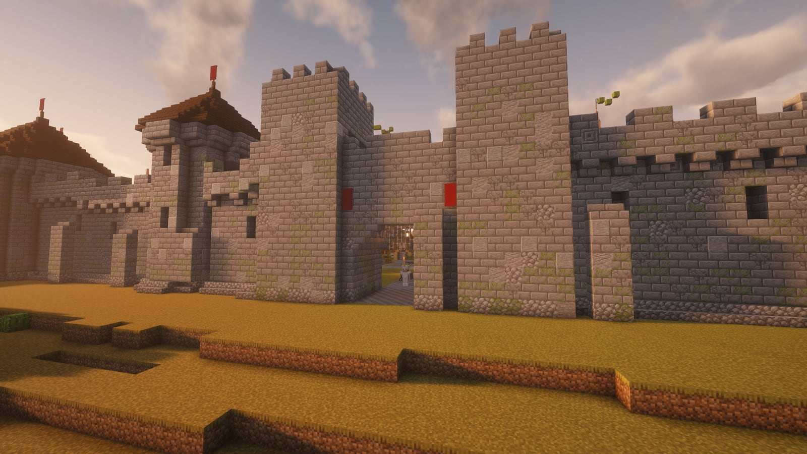
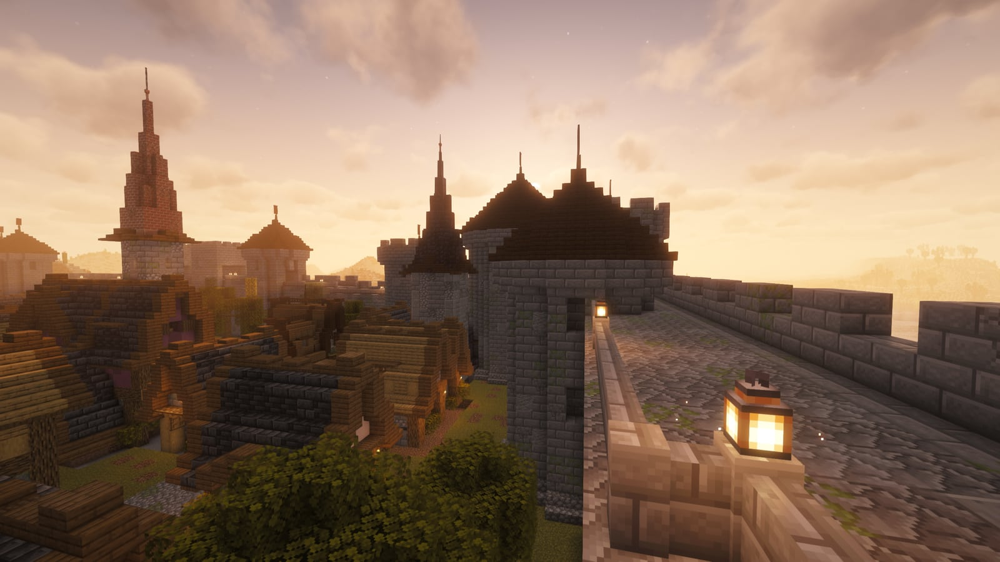
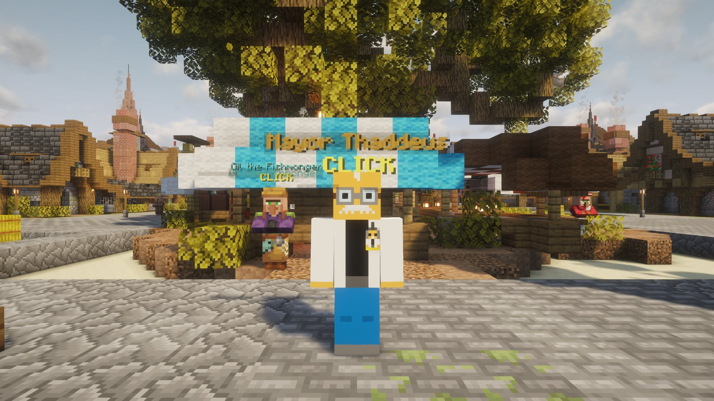
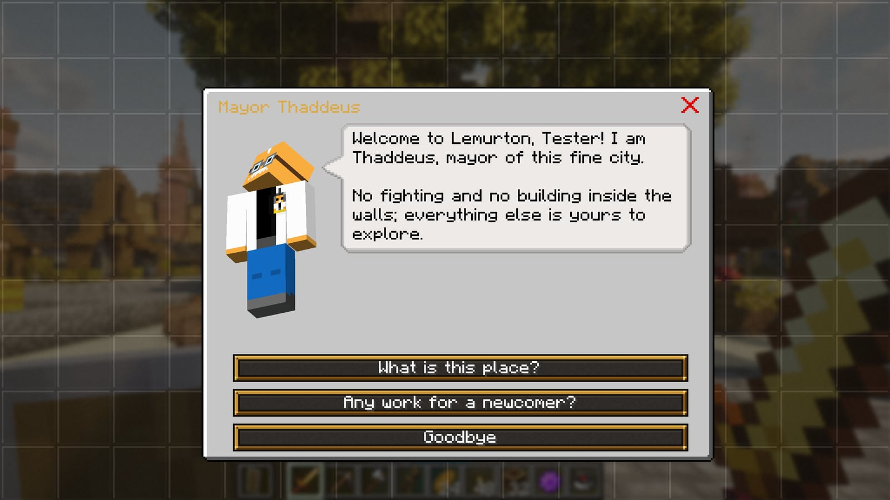
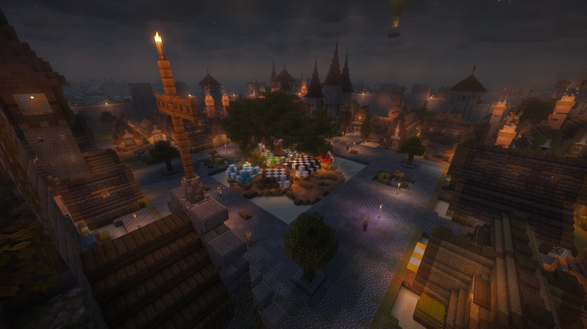

# Lemurton

**Lemurton** is the realm's first city, built in the style of RuneScape's Varrock and Lumbridge. The server raises it the first time a new world starts, from [Luki's Grand Capitals](https://modrinth.com/mod/lukis-grand-capitals) by Luki.

<figure><figcaption>
Lemurton from the south
</figcaption></figure>

## Finding it

You don't wake up in the city: it stands a few minutes' walk from spawn (400 to 700 blocks), out of sight on purpose. Your first login hands you a **Compass to Lemurton**, and a line in chat says how far it is and which way. Finding the city is the first quest.

Once you've been there, touch the **Lemurton waystone** in the market square. It's a global waystone, so it's on everyone's list from the start, and from any other waystone (or with a warp stone or scroll) you can warp back. See [Waystones](waystones.md).

## Your first quest

**Mayor Thaddeus**, at the south edge of the market, gives the first quest, *Welcome to Lemurton* (the first chapter in the quest book): ask him for work, buy something from Bessa the Baker at the market, then report back. The rewards hand themselves over as you go, and Bessa's shop shows where you are in it. The main quests start with Lemurton's people too: the Cook, Sir Vyvin's squire and the Champions' Guild, leading to Dragon Slayer I. See [Quests](quests.md#main-quests).

## The city

<figure><figcaption>
The walls from the north-east
</figcaption></figure>

- **The market square**, round a great tree in the middle of the city, with the waystone and the market stalls.
- **The cathedral** to the north of the market, a church to the south-east, and a fountain square to the south.
- **Shops and houses** along the ring streets, with cottages, farms, stables and wizard towers out towards the walls.
- **The walls:** a curtain wall with round towers, some crenellated and some under conical roofs, a walkway you can climb up to and walk all the way round, and four gatehouses with guards.

<figure><figcaption>
The cathedral
</figcaption></figure>

<figure><figcaption>
A ring street
</figcaption></figure>

<figure><figcaption>
The south gate
</figcaption></figure>

<figure><figcaption>
The wall walk
</figcaption></figure>

## A safe zone


Inside the walls nobody can break or place blocks, pour lava or water, or start fires. Players can't hurt each other, and hostile mobs don't spawn (any that wander in are removed). Doors, chests, waystones, shops and the townsfolk all work as usual.


Admins build there in creative mode. Outside the walls the usual rules apply: PvP is on and nothing is claimed.

## Who's who

Everyone in Lemurton has their name over their head and a yellow **CLICK** under it. Right-click to talk; for a vendor, right-click again for the shop. The townsfolk can't be hurt or pushed around.

<figure><figcaption>
Mayor Thaddeus
</figcaption></figure>

| Who | Where | What they do |
|---|---|---|
| Mayor Thaddeus | The south edge of the market | Gives the first quest, *Welcome to Lemurton*, and the Anti-dragon Shield for Dragon Slayer I (and a copy if you lose it) |
| Old Wren | Market stall | Fruit and vegetables |
| Bessa the Baker | Market stall | Bread, cake and pies; buying from her is a step of *Welcome to Lemurton* |
| Imran the Gem Trader | Market stall | Gems and crystals |
| Saffi the Spice Merchant | Market stall | Seeds from the far south (Farmer's Delight crops), sugar and cocoa |
| Gil the Fishmonger | Market stall | Fish, cooked or raw |
| Maud the Weaver | Market stall | Wool in every colour, and string |
| Posy the Flower Seller | Market stall | Flowers and saplings |
| Ragnar the Butcher | Market stall | Meat |
| Brann the Smith | The smithy | Tools and weapons; forges the sword in *The Knight's Sword* |
| Odo the Tailor | The tannery | Leather armour and saddles |
| Sister Agnes | The apothecary | Potions and brewing supplies |
| Hamish of the Docks | The fishing shop | Rods, line and bait |
| Gerta the Mason | The builder's merchant | Stone, brick and timber by the stack |
| Lucan the Jeweller | The jeweller's | Gold and gems; sells a piece of the map to the stronghold |
| Pip the Shopkeeper | The general store | A bit of everything |
| Cook | The butcher's shop on the ring street | *Cook's Assistant* |
| Squire Asrol | The armourer's | *The Knight's Sword* |
| Guildmaster Greaves | The Champions' Guild | Starts *Dragon Slayer I* and runs the guild's trial |
| Oziach | The armoury on the ring street | Tells you how to reach the Ender Dragon and Elvarg, and takes their heads (*Dragon Slayer I* and *II*) |
| Wizard Traiborn | His tower by the wall | Trades a piece of the map for a ghast tear, a blaze rod and an amethyst shard, and scries Crandor for *Dragon Slayer II* |
| City Guards | The four gatehouses | Keep the peace |
| Townsfolk | About the streets | Gossip |

Every vendor buys anything you bring, whatever they sell themselves. See [Coins, vendors and trading](economy.md) for how prices work, and [Quests](quests.md#main-quests) for the questlines.

<figure><figcaption>
The first right-click is always a talk
</figcaption></figure>

## By night

<figure><figcaption>
The market after dark
</figcaption></figure>

Lanterns light the streets and the market after dark.

## Other towns

The world has more cities. Luki's Grand Capitals turns villages into **grand capitals** in five styles (plains, desert, savanna, snowy and taiga), at least 1,100 blocks apart, so two of the same kind are never near each other. There are smaller villages too (Towns and Towers). Every town has a name of its own, which shows on screen as you walk in, and the names suit the land: a plains town might be Ashford or Kingsbury, a snowy one Frostheim, a desert one Al Kharzan. No two towns share a name.

A world that existed before the city came to the pack doesn't get one.
