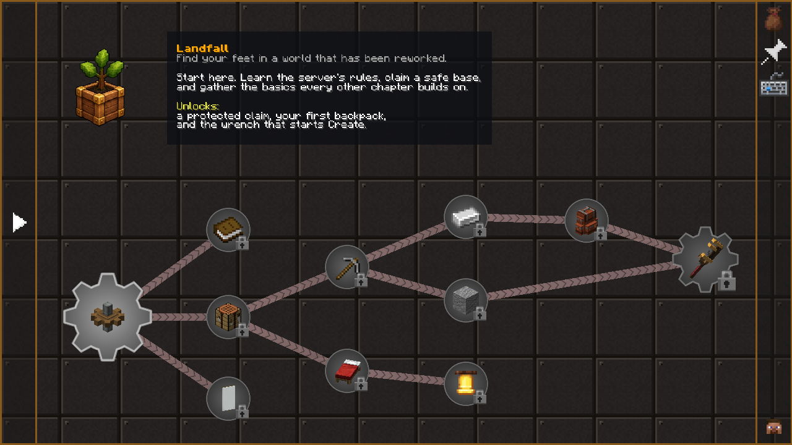

# Quests

The quest book (ESC → Quests) is a road map, not a gate: nothing is locked behind it except dragon armour, which waits on Dragon Slayer I as the rune platebody does in RuneScape. Every quest pays XP, coins and a roll on a reward crate, and the crate gets better as the quests get harder. Finish a chapter and its last quest hands out a prize worth the trip.

**Ctrl + mouse wheel** zooms the quest map. Drag to pan. Click a quest to read it and to claim its rewards once it is done.

## Chapters

Thirty-three chapters. The Ages are the main road through Create; the Main Quests (below) only show up once someone gives them to you; the rest are questlines you dip into whenever they fit what you are doing.

## Main quests

RuneScape style: Lemurton's people have troubles of their own, and a quest only appears in your book (under **Main Quests**) once someone has given it to you. Its steps then show up one at a time as you go, and the rewards hand themselves over. Right-click everyone; the ones with a quest say so.

| Quest | Given by | What it takes | Rewards |
|---|---|---|---|
| Cook's Assistant (novice) | The Cook, in the butcher's shop on the ring street | A bucket of milk, an egg and a pot of flour (wheat ground in a Create millstone) | 1 quest point, Cooking XP, coins |
| The Knight's Sword (intermediate) | Squire Asrol, at the armourer's | Brann the Smith forges a new sword from a brass ingot, a precision mechanism and two iron ingots | 1 quest point, Smithing XP, coins |
| Dragon Slayer I (experienced) | Guildmaster Greaves, at the Champions' Guild (needs the two quests above and Welcome to Lemurton) | See below | 2 quest points, the right to wear dragon armour, Attack and Defence XP, 25,000 coins and more |

**Dragon Slayer I**, as in RuneScape: Oziach, who keeps the armoury on the ring street, tells you how to reach Elvarg on the isle of Crandor.

1. Get an **Anti-dragon Shield** from Mayor Thaddeus. Held in either hand, it lets through only a fifth of a dragon's breath, and her fire won't catch on you.
2. Find the three pieces of the map: **Lucan the Jeweller** sells one for 10,000 coins, **Wizard Traiborn** (in his tower by the wall) trades one for a ghast tear, a blaze rod and an amethyst shard, and the **Champions' Guild** gives the third for its trial (20 zombies and 10 skeletons).
3. Oziach puts them together: the **Map to Crandor** is a compass that points to the isle (the nearest fire dragon roost to Lemurton).
4. Go there. **Elvarg**, a fire dragon in her prime, rises when you arrive. Everyone with the map who is nearby when she falls gets her head.
5. Bring **Elvarg's Head** to Oziach.

Until then, dragonscale and dragonsteel armour can't be worn: it comes straight off again.

**The Ages** — one chapter per stage of progress:

| Chapter | What it covers | Ends with |
|---|---|---|
| Landfall | Rules, first tools, iron and Hardness I, a backpack, a village | A wrench, and a starter crate of alloy and cogs |
| First Rotation | Water and wind power, presses, fans, belts, saws, drills, zinc, ore veins | 32 andesite casing |
| Brass Age | Blaze burners, mixing, brass, precision, sturdy sheets, arms, crafters, steam | A rotation speed controller |
| Banners of the Overworld | Outposts, raids, the Illager fort and Invoker, Create ruins | Raise your banner |
| Iron Roads | Track, stations, schedules, signals, parcels, stock keeping, and waystones for the trip home | A line between two towns |
| Skyward | Create Aeronautics and Simulated: propellers, envelopes, levitite, the physics assembler, the helm, docking, navigation | Maiden voyage |
| Crown of Fire | Fortresses, citadels, bastions, piglin castes, blaze cakes, netherite | The Wither |
| Legacy | The stronghold, the End, the dragon, elytra, crushing wheels, banking | Build your legacy |

**Industry** — factories and production lines:

| Chapter | What it covers | Ends with |
|---|---|---|
| Factory Floor | Fan processing, harvesters, compacting, automated assembly, arms with ten targets, a level 8 boiler | Factory gauges ordering their own ingredients |
| Railway Company | Whistles, conductors, signals, timetables, the Nether express, a 5000-block trip, a six-carriage train, a track factory | Grand Central: a station where three lines meet |
| The Foundry | Infinite lava, crushing wheels at full speed, sturdy sheets, industrial iron, ancient debris, netherite, lava diving | Four compacted netherite |
| The Enchanter | The first table, Telekinesis, Mending, levels past the vanilla max, and the five Hardness tomes | A book of Sharpness X |
| Arcane Works | Create: Enchantment Industry: grindstones, experience hatches, blaze enchanters, printers, forgers, templates, super experience | A blaze enchanter used a thousand times |
| The Warehouse | Vaults, sorting lines, chain conveyors, frogports, stock links, redstone requesters, Create backpack upgrades | 32 vaults, stock-linked |
| Grand Kitchen | Farmer's Delight from skillet to feast: compost, rice, chocolate, the spout foods, crop rotation, a netherite knife | Master Chef: every meal eaten |

**Expeditions** — places to go and things to hunt:

| Chapter | What it covers | Ends with |
|---|---|---|
| Cartographer | Waypoints and maps, Lootr chests, When Dungeons Arise, Structory towers, Towers of the Wild, Dungeons and Taverns, Regions Unexplored | Adventuring Time: every Overworld biome |
| Deep Dark | Sculk, sneaking, the ancient city, echo shards, disc 5, the ward and silence trims | The Warden |
| Beyond the Dragon | Gateways, chorus, end cities, shulkers, dragon's breath, Nullscape biomes, the End castle | Respawn the dragon |
| Village Life | Trading, Towns & Towers, bells, golems, guards, curing, fortified villages, raid captains | Hero of the Village |
| Relic Hunter | The twenty relics, where each one drops, research and levelling, set synergies | Relic Master: fifteen of twenty |

**Field Guides** — side chapters:

| Chapter | What it covers | Ends with |
|---|---|---|
| Backpack Workshop | Backpack tiers by Create age, upgrades, stack upgrades | The netherite backpack |
| Homestead | Farmer's Delight basics, new crops, rich soil, breeding | The happy ghast |
| Bestiary | The new mobs and bosses, one quest each | — (a collection) |
| Atlas | Terralith biomes and rebuilt structures | — (a collection) |
| Coin & Commerce | Gold Coins, selling and buying at vendors, trading, table-cloth shops | 10,000 coins |
| The Armory | The pack's own gear: tools, weapons, armour sets | The Compacted Netherite set |
| Hearts & Graves | The hearts system: what a death costs, Grave Essence, the Lost Item and Seeker's compasses, holding a Heart | A new Heart made from a Heart of the Sea |

**Mastery** — the long game: Skills (below) and Contracts (Brassworks Missions milestones from 10 to 1000 missions).

Each chapter opens with a card that says what the questline is for and what finishing it lets you do.

## How rewards scale

Every quest has a tier. The tier sets its XP, its coins and the crate it rolls on once:

| Tier | XP | Coins | Crate | What the crate holds |
|---|---|---|---|---|
| 1 Settler | 25 | 80 | Settler's Supplies | Ingots, alloy, torches, food, coal, arrows, tea |
| 2 Engineer | 60 | 240 | Engineer's Crate | Cogs, shafts, casing, sheets, belts, funnels, zinc, upgrade bases |
| 3 Artisan | 150 | 480 | Artisan's Crate | Brass, precision mechanisms, sturdy sheets, machines, backpack upgrades, warp scrolls, feasts |
| 4 Master | 400 | 1,280 | Master's Cache | Enchanted books, relics, warp and portal scrolls, mechanical arms, gear tools, advanced backpack upgrades |
| 5 Legend | 1000 | 5,120 | Legend's Hoard | Relics, Duelist's Patterns, loot-only gear, warp stones, waystones, netherite, totems, Mending |

Hover a crate in the reward list to see everything in it and the odds. Chapter finales add fixed prizes on top (gear pieces, relics, coins, capes), so the last quest of a line is always worth reaching.

- XP is vanilla experience, for enchanting; it does not train skills.
- Coins are Gold Coins, one stack however many you have. Spend them at the vendors or trade them; see [Coins, vendors and trading](economy.md).
- Team progress is shared: if you are in a team, everyone gets the quest and can claim its rewards.

## The Skills chapter

Every Project MMO skill has a milestone quest at 10, 25, 50, 75 and 99, and the total-level ladder runs 100, 250, 500, 750, 1000 and Maxed (1386, every skill at 99). You cannot tick these: the server reads your levels every few seconds, and shortly after you log in, and completes the ones you have reached. A chat line tells you, with a link to the book, and the reward waits there to be claimed.

The rewards climb with the level: a Settler crate at 10, a Legend's Hoard at 99. Level 50 and 75 add a prize made for the skill (the Excavator's Pickaxe for Mining, the Stormcaller's Sabre for Attack, an elytra for Agility, a relic for Cooking). Level 99 pays 40,000 coins, a relic and two rolls on the Legend's Hoard, and the skill's cape unlocks by itself (`/capes`). Maxed is 80,000 coins and the Maxed Cape.
