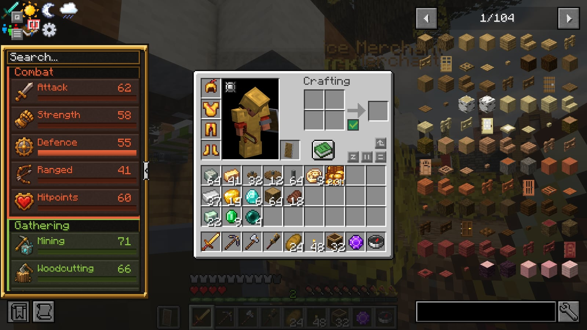
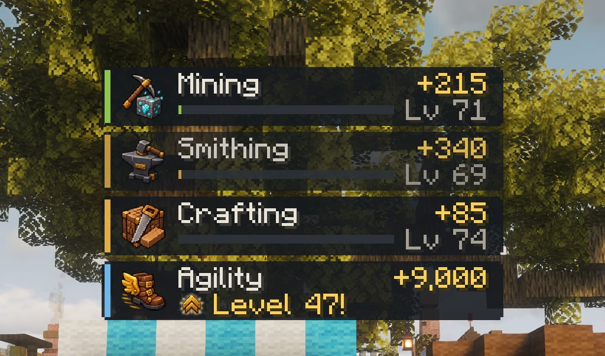
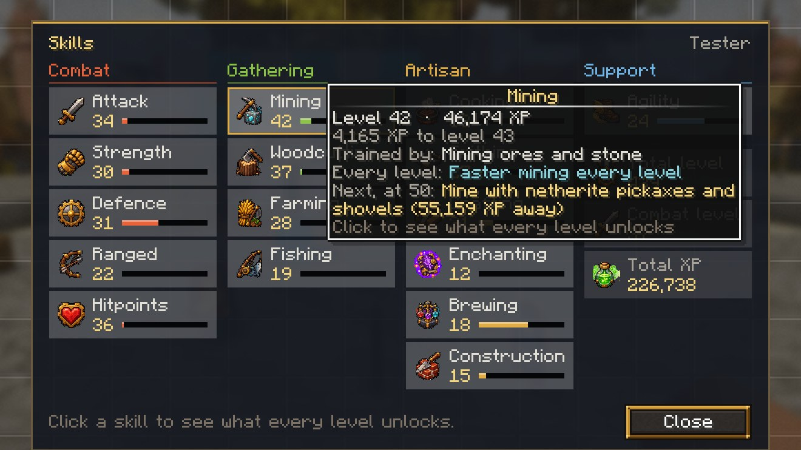
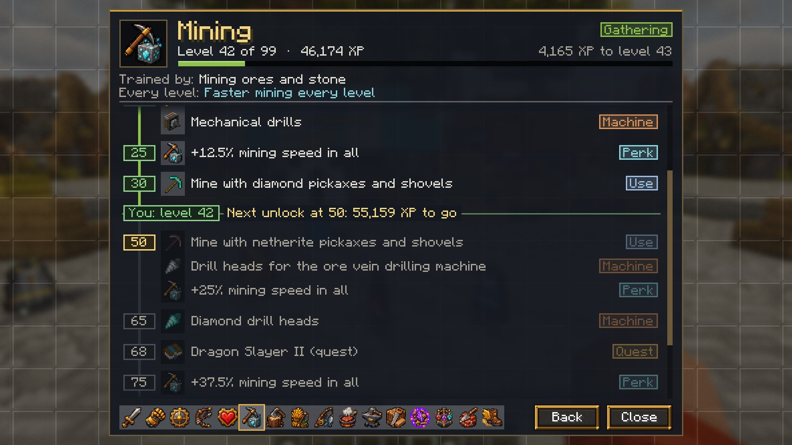
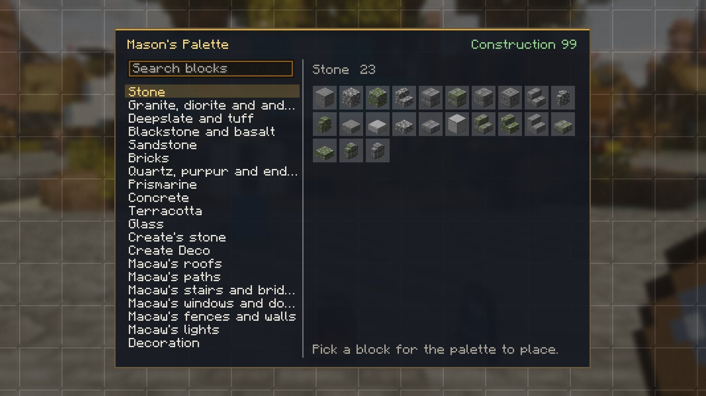
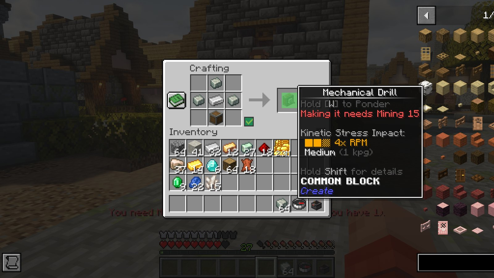

# Skills

Sixteen RuneScape-style skills, levels 1–99, on RuneScape's XP curve (level 99 is 13,034,431 XP). Every level makes you a little stronger, and as in RuneScape each skill unlocks things as it grows: gear you can wield and wear, things you can make, potions you can brew, crops you can plant, trees you can chop and blocks you can build with. The main quests ask for skills too.

Your inventory (**E**) has a skills panel on the left: every skill, its level and progress. Hover a row for the XP to the next level; click it for that skill's guide (below). Item tooltips show the level an item needs, to use it or to make it.

XP shows up as it comes in, in a small tracker at the top of the screen, just below the block info. Each skill that just gained XP gets a card with its icon, the XP so far (it keeps counting up while you work), its level and a bar towards the next one. When a gain takes you up a level, the card turns gold and says **Level N!** for a few seconds. Cards fade out a few seconds after the last XP. Move or hide the tracker in ESC → HUD Layout ("XP gains").

<figure><figcaption>
The XP tracker: a card per skill, counting up as you work
</figcaption></figure>

## The skills screen

ESC → **Skills** (or `/skills`) shows every skill in its group, Combat, Gathering, Artisan and Support, as RuneScape's skills tab does: its level and a bar towards the next, with your total level, combat level and total XP. Hover a skill for its XP, the XP to the next level, what trains it, what every level gives and what it unlocks next.

<figure><figcaption>
ESC → Skills, hovering Mining
</figcaption></figure>

Click a skill, here or in the inventory's panel, for its guide: every level that unlocks something, down a track lit as far as you've got. Each unlock shows its item and what sort of thing it is (wield, wear, use, make, machine, plant, chop, brew, catch, perk, quest or cape); hover one for what that means and how much XP it is away. A marker shows your level and the XP to the next unlock. The strip along the bottom, or the arrow keys, switches skill, and `/skills mining` opens a skill's guide straight away.

<figure><figcaption>
Mining's guide at level 42
</figcaption></figure>

## The skills

| Group | Skill | Trained by | Each level gives |
|---|---|---|---|
| Combat | Attack | Hitting things | +0.04 melee damage, +0.4 % bow damage; wields weapons |
| Combat | Strength | Hitting things | +0.3 % melee critical chance (1.5× damage) |
| Combat | Defence | Being hit while wearing armour | +0.02 armour; wears armour |
| Combat | Ranged | Arrows, tridents, rockets | +0.3 % ranged critical chance; crossbows and tridents |
| Combat | Hitpoints | Any fight (slowly) | +0.2 max health (a heart per ten levels) |
| Gathering | Mining | Ores and stone | Faster mining; pickaxes, and the Hardness that harder ores need |
| Gathering | Woodcutting | Logs | Faster chopping; axes, and the rarer trees |
| Gathering | Farming | Harvesting crops | Faster tilling; hoes, and more crops to plant |
| Gathering | Fishing | Catching fish | Better catches; treasure from level 20 |
| Artisan | Cooking | Cooking food | Recipes: soups, cakes, pies, feasts |
| Artisan | Smithing | Smelting metals, smithing gear | Recipes: gold, iron and netherite gear, anvils |
| Artisan | Crafting | Crafting | Recipes: bows, shields, diamond gear, ender chests, beacons |
| Artisan | Enchanting | The enchanting table | How far enchantments go ([Enchanting](enchanting.md)) |
| Artisan | Brewing | Brewing potions | Which potions you can brew; eyes of ender at 55 |
| Artisan | Construction | Building | +0.1 % chance a block you place isn't used up; decorative blocks in bulk; the Mason's Palette at 99 |
| Support | Agility | Moving, sprinting, swimming | +0.01 % speed, −0.5 % fall damage (max 50 %); the elytra |

Every ten levels a skill fires fireworks. You keep every level when you die.

## Combat level

Your combat level is worked out the way RuneScape works it out, from your combat skills: a quarter of Defence plus Hitpoints, plus 0.325 times the better of Attack plus Strength, or one and a half times Ranged. It runs from 1 to 113 here (there's no Prayer or Magic), and it shows under your name. Some drops and quests wait on it: see below.

## Construction

Construction is building. Every block you place pays XP once it has stood for a minute, and the fancier the block, the more it pays: a cobblestone wall pays little, cut and polished stone more, Macaw's roofs, windows and furniture and Create Deco more again, and a lectern or a sea lantern most of all. The ground as you found it (dirt, sand, gravel, natural stone, logs) pays nothing, nor do machines, chests, redstone, rails, torches or scaffolding. A spot pays once, so pulling a block down and putting it back earns nothing; build somewhere new. The Builder's Wand's blocks pay too.

- **Saving blocks.** Each Construction level adds a 0.1 % chance that a block you place goes back in your bag (almost 10 % at 99). A block the perk saved you is free: if it's broken later it drops nothing, so it can never be turned into more than you had. It only ever saves building blocks: never storage blocks (iron, gold, diamond and the rest, modded ones too), beacon bases, ores, copper of any kind, coin stacks or amethyst, and never anything that holds items or has contents (chests, shulker boxes, backpacks, machines).
- **Decorative blocks in bulk.** Construction unlocks recipes of its own at the crafting table: ten stone bricks from eight stone and a clay ball, mossy and cracked kinds without a furnace, eight stairs where vanilla gives four, a lantern for less iron. The guide below lists them all.
- **The Mason's Palette** comes with the Construction Cape at 99. Right-click the air to open it and choose a block, then right-click to place as many as you like: none are used up. Middle-click a block to choose that kind. It holds stone of every kind, deepslate, tuff, blackstone, sandstone, bricks, quartz, purpur, prismarine, concrete, terracotta, glass, Create's cut stone, Create Deco and the stone and metal blocks of Macaw's mods, and a few decorations (lanterns, chains, bars, end rods, lecterns).

<figure><figcaption>
The Mason's Palette's picker
</figcaption></figure>

- **Why it can't be farmed.** What the palette places drops nothing when broken, and stays put: pistons and Create's contraptions won't move it, an explosion or a drill takes it without drops, and it rides an airship without losing that. It never places anything you'd otherwise grow or gather (no wood, wool, crops or ores), nothing that falls, holds items or weathers, nothing with redstone, and nothing Create can crush, mill or wash into something else. Lost it? Gerta the Mason in Lemurton makes another for 10,000 coins.

## Using gear

| Level | Attack (wield) | Defence (wear) | Ranged (use) | Mining / Woodcutting / Farming (use) |
|---|---|---|---|---|
| 5 | Stone swords, axes | Copper diving gear | — | Stone tools |
| 10 | Golden | Golden, chainmail | — | Golden |
| 15 | Iron | Iron | — | Iron |
| 20 | — | Turtle helmet | Crossbows, potato cannon | — |
| 30 | Diamond | Diamond | — | Diamond |
| 40 | — | — | Tridents | — |
| 50 | Netherite, mace | Netherite, netherite diving gear | — | Netherite |

Agility 30 unlocks the elytra. Wielding a weapon you're not ready for gives Weakness; wearing armour you're not ready for gives Slowness.

## What each skill unlocks

Like a RuneScape skill guide: the level each thing needs.

- **Making things.** If a recipe needs a level you don't have, its result stays in the crafting grid (or the smithing table, or the cooking pot) and a message says what it takes. The item's tooltip says it too. Create's crafting blueprint asks the same of whoever clicks it.
- **Create's machines** each wait on the skill they take over: Mining for drills, Woodcutting for saws, Farming for harvesters and ploughs, Cooking for fans, Crafting for mechanical crafters, Construction for the schematicannon, Smithing for steam engines, Agility for trains and Enchanting for the blaze enchanter and the printer. The [Create machines](#create-machines) table lists them by level. Anyone can use a machine someone else made.
- **Machines.** The Crafter and Create's mechanical crafters, basins (with their mixer or press) and spouts work at the skill levels of the player who last placed or right-clicked them. If that player doesn't have the level an item or recipe on these lists needs, the machine won't make it (and a mixer won't brew with an ingredient past their Brewing), and they get a chat message with a ding saying which. Drills and saws are held to the same levels: they won't break a block past their operator's level (a log past their Woodcutting chop level stays standing). On a moving contraption, a drill or saw keeps the operator it had when the contraption was put together. Right-click a machine to make it run at your levels. A machine nobody has placed or clicked makes nothing gated. Whoever its operator is, its work pays XP to every player within 16 blocks of it ([Machine XP](create-tips.md#machine-xp)).
- **Backpacks, relics and totems.** A backpack upgrade only works once you have the level it takes to make it; a backpack set down as a block works at the levels of whoever last placed or opened it. A relic's abilities wait for the level it needs to wear, and a Totem of Undying only saves you at Hitpoints 50. Each tells you in chat, with a ding, what's missing.

<figure><figcaption>
A mechanical drill at Mining 1: the result stays in the grid
</figcaption></figure>

- **Brewing stands and cooking pots** that hoppers feed work at the level of whoever last opened them. An ingredient you aren't ready for won't go into a stand by hand.
- **Enchantments** past their vanilla level need two skills: Enchanting to make them, and the gear's own skill to use them. Fishing for Luck of the Sea and Lure, Mining for Fortune and Efficiency, Attack for Sharpness and Looting, Ranged for Power, Defence for Protection, Agility for Feather Falling. See [Enchanting](enchanting.md).

<!-- skill-guide: generated by skills/build.mjs from skills/unlocks.mjs -->

### Crafting

| Level | Lets you make |
|---|---|
| 5 | Leather armour |
| 5 | Pickup and filter upgrades |
| 10 | Bows |
| 10 | Copper backpacks |
| 10 | Bundles |
| 15 | Shields |
| 15 | Toolboxes |
| 15 | Crafting upgrade and the starter stack upgrade |
| 20 | Crossbows |
| 20 | Climbing Boots (a relic: step up full blocks) |
| 20 | Item vaults |
| 20 | Item silos (a vertical item vault) |
| 20 | Shipping containers (dyed item vaults) |
| 20 | Iron backpacks |
| 20 | Restock, deposit and refill upgrades |
| 25 | Mechanical arms |
| 25 | Void, tool swapper, tank and stack tier 1 upgrades |
| 30 | Diamond tools, weapons and armour |
| 30 | Pressing upgrades |
| 30 | Magnet, compacting and advanced pickup/filter upgrades |
| 30 | Diamond knives |
| 35 | Aeronaut's Rigging (for the Aeronaut set) |
| 35 | Capacitors (and so electric motors, tesla coils and accumulators) |
| 35 | Mixing upgrades |
| 35 | Gold backpacks |
| 40 | Enchanting tables |
| 40 | Duelist's Filigree (for the Brass Duelist set) |
| 40 | Advanced restock, deposit, refill, void and tool swapper upgrades, and stack tier 2 |
| 45 | Stock tickers, redstone requesters and factory gauges |
| 45 | Advanced magnet and advanced compacting upgrades |
| 45 | Dragon horns |
| 45 | Dragon seekers |
| 45 | Horns of Sight |
| 50 | Ender chests |
| 50 | Diamond backpacks |
| 50 | Ender linkers |
| 55 | Dragonbone tools, sword and bow |
| 60 | End crystals |
| 60 | Flamed, iced and lightning dragonbone swords |
| 60 | Dragonscale armour (all twelve colours) |
| 65 | Shulker boxes |
| 65 | Summoning crystals |
| 70 | Conduits |
| 75 | Beacons |
| 80 | Respawn anchors and lodestones |

### Smithing

| Level | Lets you make |
|---|---|
| 10 | Golden tools, weapons and armour |
| 10 | Golden knives |
| 15 | Iron tools, weapons and armour |
| 15 | Smelting upgrade |
| 15 | Iron knives and the skillet |
| 20 | Anvils and hoppers |
| 20 | Silver tools, weapons and armour |
| 25 | Prospector's Plating (for the Prospector set) |
| 25 | Blasting and anvil upgrades |
| 40 | Copying armour trim templates |
| 40 | Auto-smelting upgrade |
| 45 | Diamond Lattice (for the Compacted Diamond set) |
| 45 | Auto-blasting upgrade |
| 45 | Platinum sheets (trim material) |
| 50 | Netherite gear (the smithing table upgrade) |
| 50 | Smithing upgrade |
| 50 | Netherite knives (smithing table) |
| 55 | Netherite backpacks (smithing table) |
| 55 | Epic dragon seekers (smithing, a nether star) |
| 60 | Copying the netherite upgrade template |
| 65 | Compacted netherite armour |
| 70 | Maces |
| 70 | Legendary dragon seekers (dragonsteel) |
| 80 | Dragonsteel tools, weapons and armour |

### Cooking

| Level | Lets you make |
|---|---|
| 5 | Beetroot soup, sandwiches and salads |
| 10 | Pumpkin pie, hamburgers, wraps and Farmer's Delight soups |
| 15 | Smoking upgrade |
| 15 | Melon juice |
| 20 | Cake, rabbit stew, stews, rice dishes and rolls |
| 25 | Feeding upgrade |
| 25 | Hot cocoa (cooking pot) |
| 30 | Golden carrots, pies, pasta and plated meals |
| 40 | Squid ink pasta, glow berry custard and nether salad |
| 40 | Auto-smoking and advanced feeding upgrades |
| 45 | Golden apples |
| 50 | Farmer's Delight feasts |
| 50 | Gleaming salad (a feast) |
| 60 | Rice with dragon meat (cooking pot) |

### Brewing

| Level | Lets you brew |
|---|---|
| 1 | Awkward potions, the base of nearly all others (nether wart) |
| 5 | Swiftness (sugar) |
| 10 | Night Vision (golden carrot) |
| 15 | Leaping (rabbit foot) |
| 20 | Fire Resistance (magma cream) |
| 25 | Healing (glistering melon slice) |
| 25 | Poison (spider eye) |
| 30 | Water Breathing (pufferfish) |
| 30 | Longer potions (redstone) |
| 35 | Strength (blaze powder) |
| 40 | Regeneration (ghast tear) |
| 40 | Potion of Berserking (goat horn) |
| 40 | Alchemical fire pits (fire rings) |
| 45 | Weakness, Harming, Slowness and Invisibility (fermented spider eye) |
| 45 | Potion of Reaching (crab claw) |
| 45 | Alchemy upgrade (crafting) |
| 50 | Splash potions (gunpowder) |
| 50 | Slow Falling (phantom membrane) |
| 55 | Eyes of ender (crafting) |
| 60 | Stronger potions (glowstone dust) |
| 60 | Advanced alchemy upgrade (crafting) |
| 65 | Turtle Master (turtle helmet) |
| 70 | Lingering potions (dragon breath) |
| 80 | Wind Charging (breeze rod) |
| 80 | Weaving (cobweb) |
| 80 | Oozing (slime block) |
| 80 | Infested (stone) |

### Farming

| Level | Lets you plant |
|---|---|
| 5 | Beetroot |
| 5 | Cabbages and onions |
| 10 | Tomatoes and sweet berries |
| 15 | Pumpkins and melons |
| 20 | Rice |
| 25 | Cocoa |
| 30 | Nether wart |
| 40 | Torchflowers and pitcher plants |
| 60 | Chorus flowers |

### Woodcutting

| Level | Lets you chop |
|---|---|
| 10 | Pine trees |
| 15 | Jungle trees |
| 15 | Palms and giant bamboo |
| 20 | Joshua trees and larches |
| 25 | Cypresses, ashen trees and bioshroom stems |
| 30 | Acacia trees |
| 30 | Willows |
| 35 | Dark oak trees |
| 35 | Eucalyptus |
| 40 | Pale oaks |
| 40 | Magnolias, wisterias and baobabs |
| 45 | Mangroves |
| 45 | Maples |
| 50 | Cherry trees |
| 50 | Kapoks |
| 55 | Socotras and blackwoods |
| 60 | Crimson and warped stems |
| 65 | Brimwood and cobalt (Nether) |
| 70 | Redwoods |

### Fishing

| Level | Lets you |
|---|---|
| 20 | Land treasure: enchanted books and gear, name tags, saddles, nautilus shells (below it, treasure comes up as a fish) |

### Ranged

| Level | Lets you use |
|---|---|
| 20 | Crossbows and the potato cannon |
| 40 | Tridents |

### Combat level

| Level | Lets you |
|---|---|
| 75 | Get wither skeleton skulls (the Wither) as drops |

### Create machines

| Level | Skill | Lets you make |
|---|---|---|
| 15 | Farming | Mechanical harvesters and ploughs |
| 15 | Mining | Mechanical drills |
| 15 | Woodcutting | Mechanical saws |
| 20 | Cooking | Encased fans (bulk smoking, blasting and washing) |
| 20 | Enchanting | Mechanical grindstones |
| 25 | Agility | Elevator pulleys |
| 25 | Cooking | Slicers |
| 30 | Construction | Schematicannons |
| 30 | Crafting | Mechanical crafters |
| 30 | Farming | Sprinklers |
| 35 | Agility | Train stations and train controls |
| 35 | Enchanting | Blaze enchanters |
| 35 | Smithing | Steam engines |
| 40 | Crafting | XP Banks (keep 10% of the XP machines earn while nobody is near) |
| 40 | Mining | Borehead bearings and rock-cutting wheels |
| 50 | Enchanting | Printers (they copy enchanted books) |
| 50 | Mining | Drill heads for the ore vein drilling machine |
| 55 | Enchanting | Blaze forgers |
| 60 | Crafting | Tier II XP Bank upgrades (the bank keeps 25%) |
| 65 | Mining | Diamond drill heads |
| 70 | Smithing | Dragonforge cores |
| 80 | Crafting | Tier III XP Bank upgrades (the bank keeps 50%) |
| 80 | Mining | Netherite drill heads |

### Other skills: making

| Level | Skill | Lets you make |
|---|---|---|
| 10 | Construction | Stonecutter upgrade |
| 20 | Agility | Return scrolls |
| 20 | Farming | Organic compost |
| 25 | Construction | Barbed wire |
| 25 | Enchanting | Experience lanterns |
| 30 | Agility | Warp scrolls |
| 35 | Mining | Ore vein finders and the vein atlas |
| 40 | Agility | Portal scrolls |
| 40 | Agility | Harnesses (to ride a happy ghast) |
| 65 | Enchanting | Imbuing tables |

### Gear, relics and blocks

| Level | Skill | Lets you |
|---|---|---|
| 5 | Attack | Wield copper sword and axe |
| 5 | Attack | Wield flint knives |
| 5 | Defence | Wear copper armour |
| 5 | Farming | Use copper hoe |
| 5 | Mining | Use copper pickaxe and shovel |
| 5 | Woodcutting | Use copper axe |
| 10 | Attack | Wield golden knives |
| 15 | Attack | Wield iron knives and the skillet |
| 20 | Agility | Wear the Springy Boot |
| 20 | Attack | Wield silver sword and axe |
| 20 | Cooking | Wear the Chef's Hat |
| 20 | Defence | Wear silver armour |
| 20 | Farming | Use silver hoe |
| 20 | Mining | Use silver pickaxe and shovel |
| 20 | Woodcutting | Use silver axe |
| 25 | Agility | Wear the Climbing Boots (a relic) |
| 25 | Agility | Use the Rider Flute |
| 25 | Defence | Wear the Piglin Mask |
| 25 | Enchanting | Wear the Experience Disperser |
| 30 | Agility | Wear the Cut Glass Boot |
| 30 | Attack | Wield diamond knives |
| 30 | Ranged | Place mounted potato cannons |
| 30 | Strength | Wear the Hunting Belt |
| 35 | Agility | Place portstones |
| 35 | Agility | Wear the Roller Skate |
| 35 | Hitpoints | Wear the Jellyfish Necklace |
| 40 | Agility | Place warp plates |
| 40 | Attack | Wield the extendo grip |
| 40 | Construction | Use the wand of symmetry |
| 40 | Defence | Wear the Totem of Freezing (held or in the charm slot) |
| 40 | Mining | Use the Lost Candle |
| 40 | Strength | Wield the Platinum Infused Hatchet |
| 45 | Agility | Place waystones (all ten styles) |
| 45 | Agility | Wear the Kinetic Belt |
| 45 | Agility | Wear the Totem of Illusion (held or in the charm slot) |
| 45 | Defence | Wear the Wildfire Crown |
| 45 | Defence | Wield bucklers |
| 45 | Defence | Wear the Reflective Necklace |
| 45 | Hitpoints | Use the Sphere of Self-Sacrifice |
| 50 | Agility | Use the warp stone |
| 50 | Attack | Wield netherite knives |
| 50 | Defence | Use the Shield of Retaliation |
| 50 | Hitpoints | Hold a totem of undying (to be saved by it) |
| 50 | Woodcutting | Wear the Leafy Mantle |
| 55 | Agility | Place sharestones |
| 55 | Agility | Use the Chorus Staff |
| 55 | Attack | Wield dragonbone sword and axe |
| 55 | Farming | Use dragonbone hoe |
| 55 | Mining | Use dragonbone pickaxe and shovel |
| 55 | Ranged | Use dragonbone bow |
| 55 | Strength | Wear the Ring of the Seven Deadly Sins |
| 55 | Woodcutting | Use dragonbone axe |
| 60 | Agility | Use the Clot of Time |
| 60 | Attack | Wield elemental dragonbone swords |
| 60 | Strength | Wear the Midnight Mantle |
| 65 | Agility | Wear the Glitchy Mantle |
| 70 | Farming | Use dragon eggs (placing one to hatch it) |
| 70 | Hitpoints | Wear the Ghostly Mantle |
| 75 | Attack | Wield dragonsteel swords and axes |
| 75 | Farming | Use dragonsteel hoes |
| 75 | Mining | Use dragonsteel pickaxes and shovels |
| 75 | Woodcutting | Use dragonsteel axes |

### Construction

| Level | Lets you make |
|---|---|
| 5 | Ten stone bricks from eight stone and a clay ball |
| 10 | Mossy cobblestone by the eight: cobblestone round a moss block |
| 15 | Mossy stone bricks by the eight: stone bricks round a moss block |
| 20 | Cracked stone bricks without a furnace: stone bricks round a flint |
| 25 | Smooth stone without a furnace: stone round a sand |
| 30 | Chiseled stone bricks by the eight: stone bricks round an iron nugget |
| 40 | Cracked deepslate bricks without a furnace |
| 45 | Cracked deepslate tiles without a furnace |
| 50 | Cracked nether bricks without a furnace |
| 55 | Cracked polished blackstone bricks without a furnace |
| 60 | Eight stone brick stairs from six stone bricks and a clay ball |
| 70 | A lantern from four iron nuggets, four glass panes and a torch |
| 99 | Use the Mason's Palette: as many of one decorative block as you like (see below) |

| XP a block | What you build with |
|---|---|
| 25 | Fine pieces: lecterns, bells, bookshelves, sea lanterns, end rods, decorated pots |
| 15 | Macaw's roofs, windows, paths, bridges, stairs, fences, lights, doors and furniture, and Create Deco |
| 10 | Fancy stone and glass: chiseled, cracked, mossy, cut, smooth, polished and tiled kinds, quartz, prismarine, purpur, end stone bricks, copper, glazed terracotta, stained glass, Create's cut stone; lanterns, chains, iron bars, doors and trapdoors |
| 5 | Building blocks: planks, bricks, stone bricks, glass, wool, concrete, terracotta and sandstone, and every stair, slab, wall and fence |
| 2 | Cobblestone and stone |
| 0 | The ground as you found it (dirt, sand, gravel, natural stone, logs, leaves, plants, ores), storage blocks, machines and anything with an inventory, redstone, rails, torches, ladders and scaffolding |

### Quest requirements

| Quest | Needs |
|---|---|
| Cook's Assistant | Nothing |
| The Knight's Sword | Mining 10, Smithing 10 |
| Dragon Slayer I | Combat 40, Brewing 55 |
| Dragon Slayer II | Smithing 70, Mining 68, Crafting 62, Agility 60, Enchanting 60, Hitpoints 50 |
| The Fight Pits | Combat 60, Defence 50, Hitpoints 50, Attack or Ranged 50 |
| Ashes of the Kiln | Defence 80, Hitpoints 80, Attack or Ranged 80 |
| The Inferno | Nothing |

<!-- /skill-guide -->

## Where the numbers come from

The curve, the perks and every gate here are generated from `skills/build.mjs` and `skills/unlocks.mjs` in the pack's repository, so these tables are the game's own.

**Enchanting** decides how far enchantments can go. Its own page, [Enchanting](enchanting.md), has the caps, the unlock levels and the Hardness tomes pickaxes need for harder blocks.
