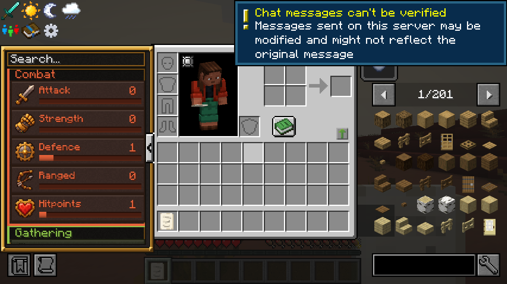

# Skills

Thirteen RuneScape-style skills, levels 1–99, with the RuneScape XP curve (level 99 is 13,034,431 XP). Every level makes you a little stronger; some items need a level before you can use them.

Open your inventory (**E**, or ESC → Skills): the panel on the left lists every skill, its level and progress. Hover a row for the XP to the next level. Item tooltips show the level an item needs.

## The skills

| Group | Skill | Trained by | Each level gives |
|---|---|---|---|
| Combat | Attack | Hitting things | +0.04 melee damage, +0.4 % bow damage; wields weapons |
| Combat | Strength | Hitting things | +0.3 % melee critical chance (1.5× damage) |
| Combat | Defence | Being hit while wearing armour | +0.02 armour; wears armour |
| Combat | Ranged | Arrows, tridents, rockets | +0.3 % ranged critical chance |
| Combat | Hitpoints | Any fight (slowly) | +0.2 max health (a heart per ten levels) |
| Gathering | Mining | Ores and stone | Faster mining; unlocks pickaxes |
| Gathering | Woodcutting | Logs | Faster chopping; unlocks axes |
| Gathering | Farming | Harvesting crops | Faster tilling; unlocks hoes |
| Gathering | Fishing | Catching fish | Better catches |
| Artisan | Cooking | Cooking food | — |
| Artisan | Smithing | Smelting metals, smithing gear | — |
| Artisan | Crafting | Crafting | — |
| Support | Agility | Moving, sprinting, swimming | +0.01 % speed, −0.5 % fall damage (max 50 %); unlocks the elytra |

Every ten levels a skill fires fireworks.

## Level gates

| Level | Attack (wield) | Defence (wear) | Mining / Woodcutting / Farming (use) |
|---|---|---|---|
| 5 | Stone swords, axes | Copper diving gear | Stone tools |
| 10 | Golden | Golden, chainmail | Golden |
| 15 | Iron, crossbow | Iron | Iron |
| 20 | Potato cannon | Turtle helmet | — |
| 30 | Diamond | Diamond | Diamond |
| 40 | Trident | — | — |
| 50 | Netherite, mace | Netherite, netherite diving gear | Netherite |

Agility 30 unlocks the elytra. Wielding a weapon you're not ready for gives Weakness; wearing armour you're not ready for gives Slowness. You keep every level when you die.

## Where the numbers come from

The curve, perks and requirements are generated from `skills/build.mjs` in the pack's repository, so this table is the same as the game's.
